# AdGen-Agentic — Architecture Reference

> End-to-end autonomous multi-agent ad generation system.  
> Stack: Python · FastAPI · LangGraph · PostgreSQL (+ pgvector) · Cloudflare R2 · Google Gemini

---

## Table of Contents

1. [System Overview](#1-system-overview)
2. [Technology Stack](#2-technology-stack)
3. [System Layers](#3-system-layers)
4. [Auth & User Management](#4-auth--user-management)
5. [Business Onboarding](#5-business-onboarding)
6. [Campaign Pipeline](#6-campaign-pipeline)
7. [Orchestrator Architecture](#7-orchestrator-architecture)
8. [Agent Architecture](#8-agent-architecture)
9. [Memory System](#9-memory-system)
10. [Human-in-the-Loop](#10-human-in-the-loop)
11. [Streaming & Real-time](#11-streaming--real-time)
12. [Database Schema](#12-database-schema)
13. [API Reference](#13-api-reference)
14. [Directory Structure](#14-directory-structure)
15. [Implementation Order](#15-implementation-order)

---

## 1. System Overview

AdGen-Agentic lets a user onboard their business once, then launch unlimited ad campaigns. Each campaign runs a four-agent autonomous pipeline that researches, strategizes, produces, and audits ad assets — with optional human review gates at critical points.

**No Redis. No separate vector DB.** Streaming is handled via PostgreSQL `LISTEN/NOTIFY`. Semantic memory uses the `pgvector` extension on the same Postgres instance. This means the entire persistence layer is a single service.

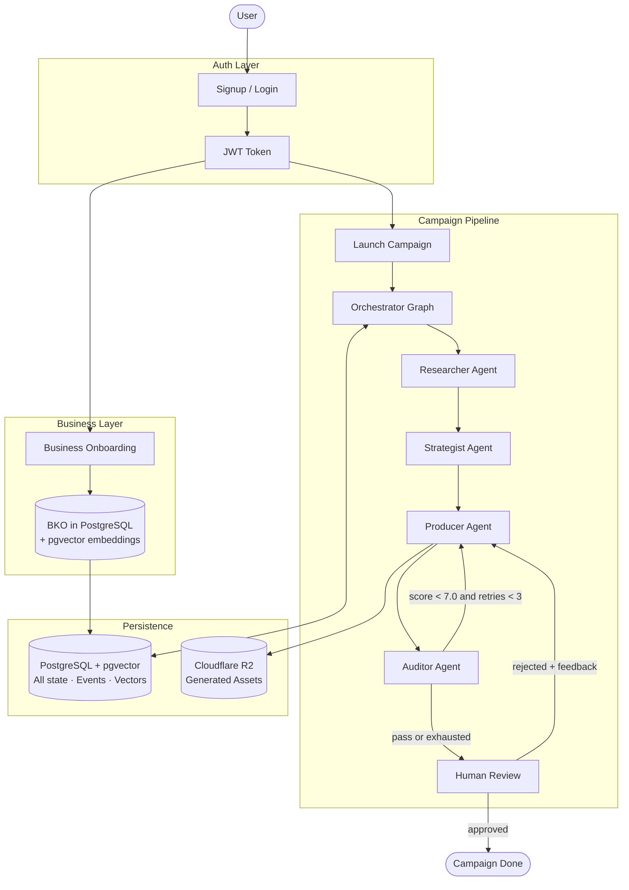

---

## 2. Technology Stack

| Layer | Technology | Purpose |
|---|---|---|
| API | FastAPI | REST endpoints + WebSocket. Async-first. |
| Auth | python-jose + passlib | JWT access/refresh tokens, bcrypt hashing |
| Orchestration | LangGraph | StateGraph, conditional edges, interrupt, PostgresSaver |
| Agents | LangGraph `create_react_agent` | ReAct loop with tool use per agent |
| LLM (text + vision) | Gemini 2.0 Flash | All text reasoning, VLM scoring (multimodal) |
| LLM (lightweight tasks) | Gemini 2.0 Flash-Lite | Fast/cheap tasks: validation, short extraction |
| Image Generation | Imagen 3 (Google AI) | Static ad images |
| Video Generation | Veo 3 (Google AI) | Short video ads with audio |
| Voice Generation | ElevenLabs | Standalone voiceover narration |
| LLM Client | LiteLLM | Unified wrapper — swap Gemini ↔ Claude in one config line |
| Relational DB + Vectors | PostgreSQL + pgvector | All state, events, BKO embeddings — single service |
| DB Migrations | Alembic | Schema versioning |
| Streaming | PostgreSQL LISTEN/NOTIFY | Real-time event relay to WebSocket — no Redis needed |
| Web Scraping | Firecrawl | JS-rendered website extraction |
| Asset Storage | Cloudflare R2 (boto3) | Generated file storage, S3-compatible |
| Containerisation | Docker Compose | Local: postgres (with pgvector) + app |
| Testing | Pytest + pytest-asyncio | Unit + integration tests |

> **Why no Redis?** For a single-server deployment, PostgreSQL `LISTEN/NOTIFY` handles pub/sub with zero extra infrastructure. If you scale to multiple workers later, adding Redis is a one-file change in `streaming_service.py`.
>
> **Why no Qdrant?** Gemini 2.0 Flash has a 1M token context window — the full BKO fits in every prompt without chunking. pgvector on the existing Postgres instance handles past-campaign similarity search. Zero extra services.

---

## 3. System Layers

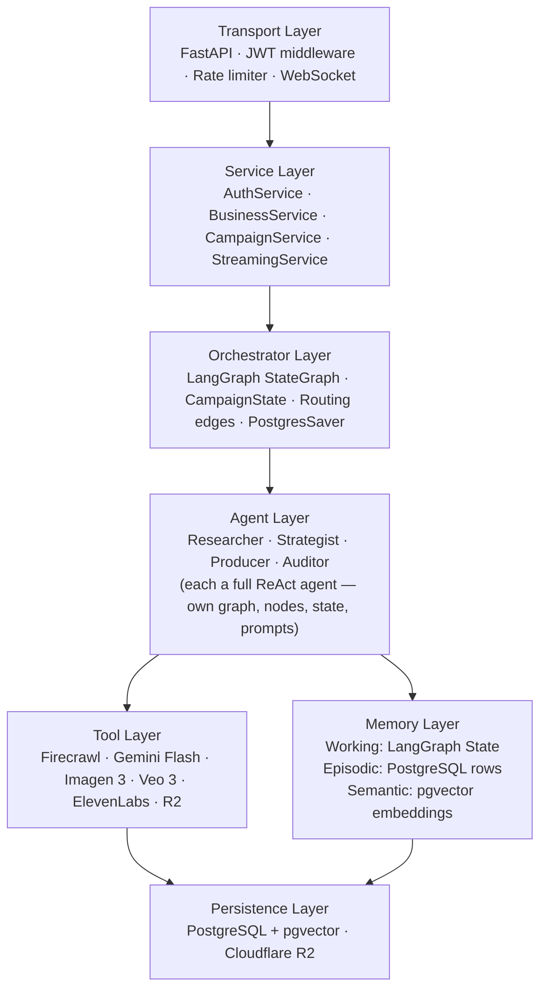

---

## 4. Auth & User Management

### Flow

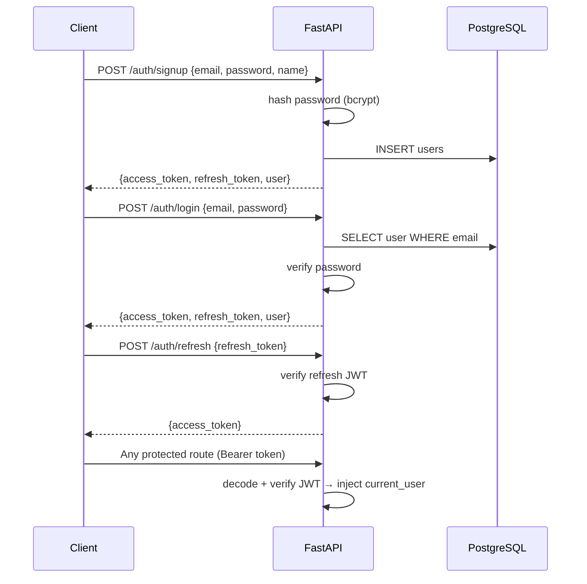

### Token Design

- **Access token**: short-lived (15 min), carries `user_id` + `email`
- **Refresh token**: long-lived (7 days), stored in DB (`refresh_tokens` table) for revocation
- All protected routes use `Depends(get_current_user)` which decodes the Bearer token

---

## 5. Business Onboarding

A business is onboarded once. Every campaign that business runs consumes the same Business Knowledge Object (BKO). The BKO is stored as JSONB in Postgres and also embedded into pgvector for past-campaign similarity search.

### Onboarding Paths

| Path | How it works |
|---|---|
| URL | Firecrawl scrapes homepage + pricing + about. Gemini Flash structures content into BKO. Gaps trigger an interrupt asking the user to fill them in. |
| Free text | User writes a paragraph. Gemini Flash extracts BKO fields. Missing critical fields trigger follow-up questions via interrupt. |
| Onboarding form | 5 structured questions map directly to BKO fields. No inference needed. Highest quality — recommended for first-time users. |

### Onboarding Flow

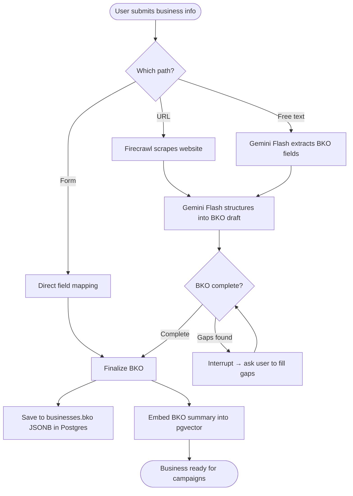

### BKO Schema

```json
{
  "meta": {
    "name": "Acme SaaS",
    "website": "https://acme.io",
    "industry": "SaaS",
    "sub_category": "Productivity",
    "business_model": "B2B subscription"
  },
  "identity": {
    "one_liner": "AI meeting summaries that cut standup time by 40%",
    "tone_of_voice": ["confident", "no-fluff", "data-driven"],
    "brand_colors": ["#1A1A2E", "#E94560"],
    "avoid": ["corporate jargon", "exclamation marks"]
  },
  "audience": {
    "primary": "SaaS founders, remote team leads, age 28-45",
    "pain_points": ["Too many unproductive meetings", "Context lost between async teams"],
    "desired_outcomes": ["Reclaim 5+ hours per week", "Team aligned without live calls"]
  },
  "value_props": [
    { "claim": "40% reduction in meeting time", "proof": "200 user study" }
  ],
  "competitors": ["Fireflies.ai", "Otter.ai"],
  "differentiators": ["Fastest summary", "Async-first by design"],
  "platform_notes": {
    "linkedin": "ROI data, professional tone, decision-makers",
    "meta": "Emotional pain/relief arc, visual product demo",
    "tiktok": "Fast-paced, founder story angle"
  },
  "campaign_history": []
}
```

> **Context window advantage**: Gemini 2.0 Flash has a 1M token context window. The full BKO is injected into every agent prompt directly — no chunking or vector retrieval needed for the current business. pgvector is used only for retrieving *past campaigns* by semantic similarity.

---

## 6. Campaign Pipeline

### Full Campaign Flow

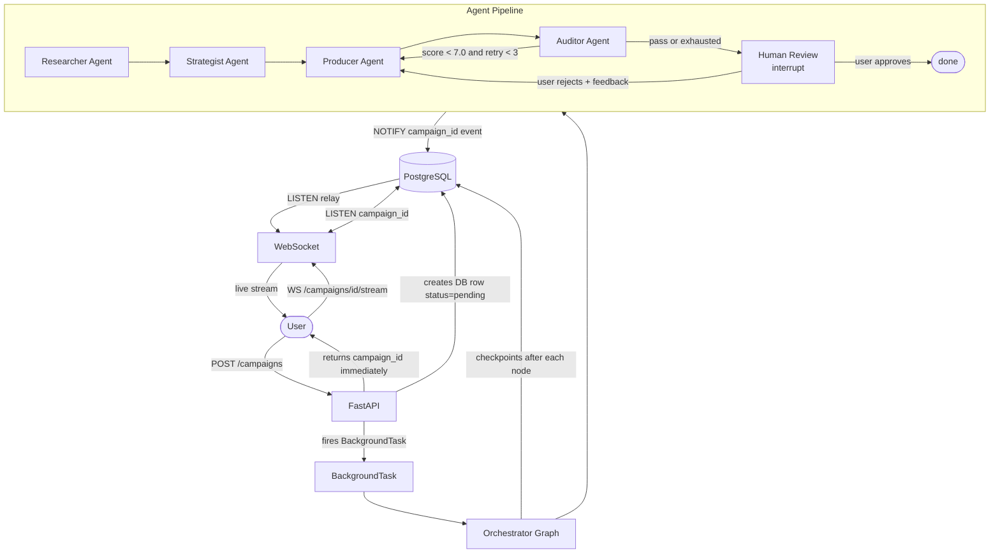

### Campaign State (shared between all agents)

```python
class CampaignState(TypedDict):
    # Identity
    campaign_id:   str
    business_id:   str
    user_id:       str
    campaign_goal: str
    platforms:     list[str]        # ["linkedin", "meta", "tiktok"]
    asset_formats: dict             # {"linkedin": "1:1", "tiktok": "9:16"}

    # Researcher output
    bko:           dict | None      # full BKO (already in Postgres, also kept in state)

    # Strategist output
    strategy_doc:  dict | None      # hooks, angles, copy direction per platform

    # Producer output
    assets:        list[dict]       # [{platform, url, format, asset_type, prompt_used}]

    # Auditor output
    audit_score:   float
    critique:      str              # structured per-asset feedback
    retry_count:   int

    # Human-in-the-loop
    awaiting_human:  bool
    human_approved:  bool | None
    human_feedback:  str | None

    # Routing
    next:   str                     # next node name
    status: str                     # pending|running|awaiting_review|done|failed
    error:  str | None
```

---

## 7. Orchestrator Architecture

The orchestrator is a thin LangGraph `StateGraph`. It has no LLM — it only routes between agents using deterministic edges based on `CampaignState`.

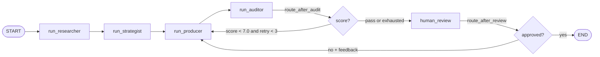

### Node Pattern

Each orchestrator node calls its agent, extracts structured output from the agent's final message, emits a Postgres `NOTIFY` event for streaming, and returns updated state. The agent's internal message history is discarded — only the structured output travels forward.

```python
# orchestrator/nodes.py

async def run_researcher(state: CampaignState, config: RunnableConfig) -> CampaignState:
    from agents.researcher.graph import researcher_agent
    from agents.researcher.prompts import build_input

    result = await researcher_agent.ainvoke(
        {"messages": [HumanMessage(content=build_input(state))]}, config
    )
    bko = extract_structured_output(result["messages"], schema=BKOSchema)
    await notify_event(state["campaign_id"], "researcher_done", {"bko_summary": bko["meta"]})
    return {**state, "bko": bko, "next": "strategist", "status": "strategising"}


async def run_auditor(state: CampaignState, config: RunnableConfig) -> CampaignState:
    from agents.auditor.graph import auditor_agent
    from agents.auditor.prompts import build_input

    result = await auditor_agent.ainvoke(
        {"messages": [HumanMessage(content=build_input(state))]}, config
    )
    score, critique = extract_audit_result(result["messages"])
    new_retry = state["retry_count"] + 1
    next_node  = "producer" if score < 7.0 and new_retry < 3 else "human_review"
    await notify_event(state["campaign_id"], "audit_done", {"score": score, "next": next_node})
    return {**state, "audit_score": score, "critique": critique,
            "retry_count": new_retry, "next": next_node}


async def human_review(state: CampaignState, config: RunnableConfig) -> CampaignState:
    await notify_event(state["campaign_id"], "human_review_required",
                       {"assets": state["assets"], "score": state["audit_score"]})
    interrupt({"assets": state["assets"], "audit_score": state["audit_score"],
               "critique": state["critique"]})
    next_node = "end" if state["human_approved"] else "producer"
    return {**state, "next": next_node}
```

### Crash Recovery

LangGraph's `AsyncPostgresSaver` checkpoints after every node completion. On crash, calling `graph.ainvoke()` with the same `thread_id` (campaign_id) resumes from the last completed node with full state intact. No extra work required.

```python
checkpointer = AsyncPostgresSaver.from_conn_string(settings.DATABASE_URL)
graph = build_graph().compile(checkpointer=checkpointer)

# Identical call for first run and resume — LangGraph handles the difference
await graph.ainvoke(initial_state, config={"configurable": {"thread_id": campaign_id}})
```

---

## 8. Agent Architecture

Each agent lives in its own folder under `agents/`. Each folder contains four files: `graph.py`, `nodes.py`, `state.py`, `prompts.py`. Agents are fully independent — no agent imports from another agent's folder.

### Agent Communication Pattern

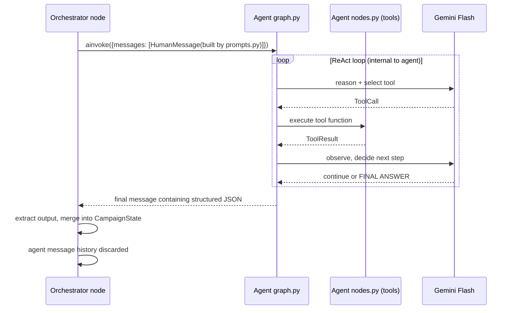

---

### 8.1 Researcher Agent

**Folder**: `agents/researcher/`

**Goal**: Build a complete, validated Business Knowledge Object from whatever input is available.

#### `agents/researcher/state.py`
```python
from typing import TypedDict
from langchain_core.messages import BaseMessage

class ResearcherState(TypedDict):
    messages:     list[BaseMessage]   # internal ReAct message history
    bko_draft:    dict | None         # intermediate BKO being built
    gaps:         list[str]           # missing fields found during validation
    attempts:     int                 # how many scrape/extract attempts made
```

#### `agents/researcher/nodes.py` — Tool functions
- `scrape_website(url: str)` — Firecrawl: scrapes homepage, /pricing, /about
- `search_web(query: str)` — Gemini Flash with search grounding (fallback if scrape fails)
- `structure_bko(raw_content: str)` — Gemini Flash call: raw text → BKO draft JSON
- `validate_bko(bko_draft: dict)` — Gemini Flash-Lite call: checks completeness, returns list of gaps
- `request_clarification(gaps: list[str])` — triggers `interrupt()`, pauses for user input

#### `agents/researcher/graph.py`
```python
from langchain_google_genai import ChatGoogleGenerativeAI
from langgraph.prebuilt import create_react_agent
from agents.researcher.nodes import (
    scrape_website, search_web, structure_bko,
    validate_bko, request_clarification
)

llm = ChatGoogleGenerativeAI(model="gemini-2.0-flash", temperature=0.2)

researcher_agent = create_react_agent(
    model=llm,
    tools=[scrape_website, search_web, structure_bko, validate_bko, request_clarification],
)
```

#### `agents/researcher/prompts.py`
```python
def build_input(state: CampaignState) -> str:
    return f"""
You are a Business Intelligence Researcher. Your job is to build a complete
Business Knowledge Object (BKO) for the following business.

Website URL: {state.get('business_website', 'not provided')}
User description: {state.get('business_description', 'not provided')}

Use scrape_website first if a URL is available. Fall back to search_web if scraping fails.
Then call structure_bko to convert raw content into the BKO schema.
Then call validate_bko to check for gaps.
If gaps exist, call request_clarification.
Return the final BKO as a JSON code block.
"""
```

#### Internal Flow

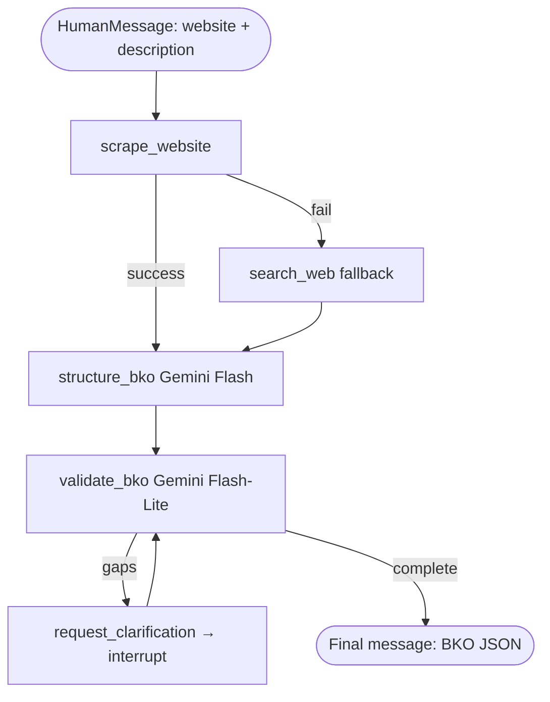

---

### 8.2 Strategist Agent

**Folder**: `agents/strategist/`

**Goal**: Reason about target audience psychology and produce a platform-specific creative strategy with hooks, copy angles, and CTAs. Self-critique and revise before finalising.

#### `agents/strategist/state.py`
```python
class StrategistState(TypedDict):
    messages:      list[BaseMessage]
    strategy_draft: dict | None
    critique_score: float | None
    revision_count: int
```

#### `agents/strategist/nodes.py` — Tool functions
- `get_past_campaigns(business_id: str, goal: str)` — Postgres + pgvector: find top 3 past campaigns most similar to current goal. Returns top hooks + scores.
- `reason_about_audience(bko: dict, goal: str)` — Gemini Flash: deep reasoning about pain points, emotional triggers, buying psychology
- `generate_strategy(bko: dict, audience_insight: str, goal: str)` — Gemini Flash: structured JSON strategy_doc with hooks + angles per platform
- `self_critique(strategy_doc: dict, bko: dict)` — Gemini Flash: scores strategy 1-10, identifies weakest elements
- `revise_strategy(strategy_doc: dict, critique: str)` — Gemini Flash: targeted revision of weak elements

#### `agents/strategist/graph.py`
```python
from langchain_google_genai import ChatGoogleGenerativeAI
from langgraph.prebuilt import create_react_agent
from agents.strategist.nodes import (
    get_past_campaigns, reason_about_audience,
    generate_strategy, self_critique, revise_strategy
)

llm = ChatGoogleGenerativeAI(model="gemini-2.0-flash", temperature=0.7)

strategist_agent = create_react_agent(
    model=llm,
    tools=[get_past_campaigns, reason_about_audience,
           generate_strategy, self_critique, revise_strategy],
)
```

#### `agents/strategist/prompts.py`
Injects the full BKO + campaign goal + past campaign summaries. Instructs the agent to use all tools in sequence and not finalise until self-critique score ≥ 7.

#### Internal Flow

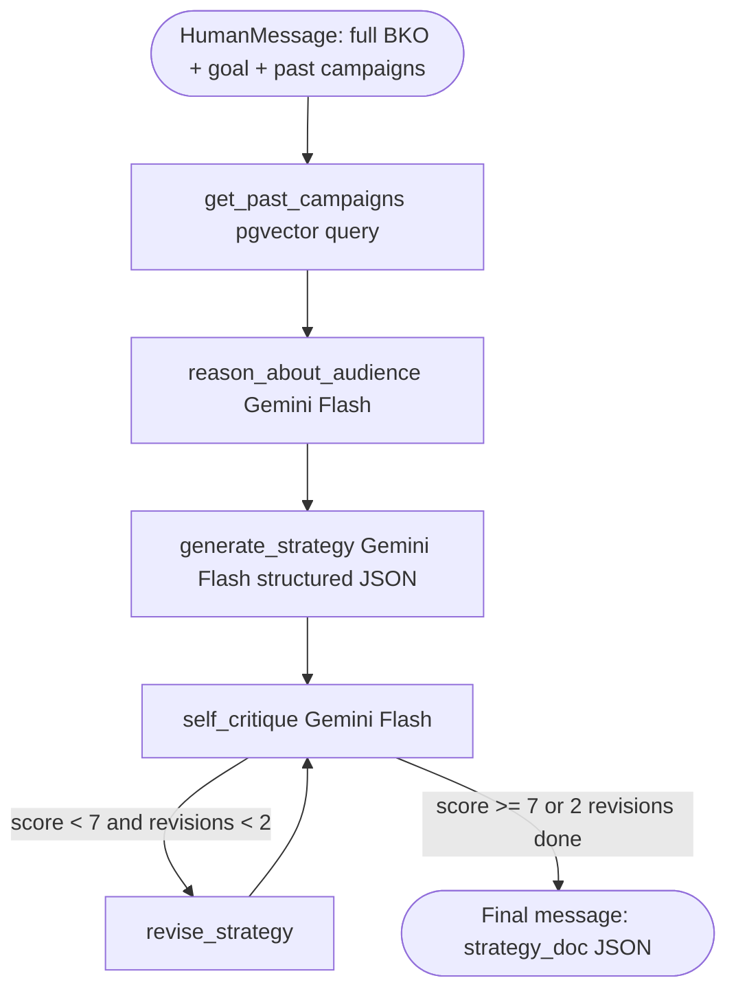

**strategy_doc schema**:
```json
{
  "platforms": {
    "linkedin": {
      "hook": "Your team is in 6 meetings a day. We cut that to 2.",
      "angle": "ROI and time savings for decision-makers",
      "copy_direction": "Lead with stat, social proof, then CTA",
      "cta": "Start free trial",
      "asset_type": "image",
      "format": "1:1"
    },
    "tiktok": {
      "hook": "POV: you just got 3 hours back from your calendar",
      "angle": "Founder relatable story",
      "copy_direction": "Fast cuts, founder voiceover, show product in 10s",
      "cta": "Link in bio",
      "asset_type": "video",
      "format": "9:16"
    }
  },
  "overall_theme": "Reclaim your time without losing alignment",
  "target_emotion": "relief + aspiration"
}
```

---

### 8.3 Producer Agent

**Folder**: `agents/producer/`

**Goal**: Generate all assets for all platforms in `strategy_doc`. Handle retries with adjusted prompts. Incorporate Auditor critique if re-rolling.

#### `agents/producer/state.py`
```python
class ProducerState(TypedDict):
    messages:         list[BaseMessage]
    pending_platforms: list[str]       # platforms not yet generated
    generated_assets:  list[dict]      # assets produced so far this run
    generation_errors: list[dict]      # failed platforms with error reason
```

#### `agents/producer/nodes.py` — Tool functions
- `build_asset_prompt(platform: str, strategy: dict, bko: dict, critique: str | None)` — Gemini Flash: writes the generation prompt incorporating strategy + critique if re-rolling
- `generate_image(prompt: str, format: str)` — Imagen 3 via Google AI API
- `generate_video(prompt: str, format: str)` — Veo 3 via Google AI API (async: submit → poll)
- `poll_video_job(job_id: str)` — checks Veo 3 job status, returns URL when done
- `generate_voice(script: str, voice_id: str)` — ElevenLabs API (standalone voiceover)
- `store_asset(file_bytes: bytes, campaign_id: str, platform: str, format: str)` — uploads to Cloudflare R2, returns public URL
- `adjust_prompt(prompt: str, failure_reason: str)` — Gemini Flash-Lite: rewrites prompt to avoid known failure mode

#### `agents/producer/graph.py`
```python
from langchain_google_genai import ChatGoogleGenerativeAI
from langgraph.prebuilt import create_react_agent
from agents.producer.nodes import (
    build_asset_prompt, generate_image, generate_video,
    poll_video_job, generate_voice, store_asset, adjust_prompt
)

llm = ChatGoogleGenerativeAI(model="gemini-2.0-flash", temperature=0.4)

producer_agent = create_react_agent(
    model=llm,
    tools=[build_asset_prompt, generate_image, generate_video,
           poll_video_job, generate_voice, store_asset, adjust_prompt],
)
```

#### `agents/producer/prompts.py`
Injects `strategy_doc`, `bko.identity` (tone, avoid list), `critique` (if retry), and instructs the agent to process every platform and not stop until all are attempted.

#### Internal Flow

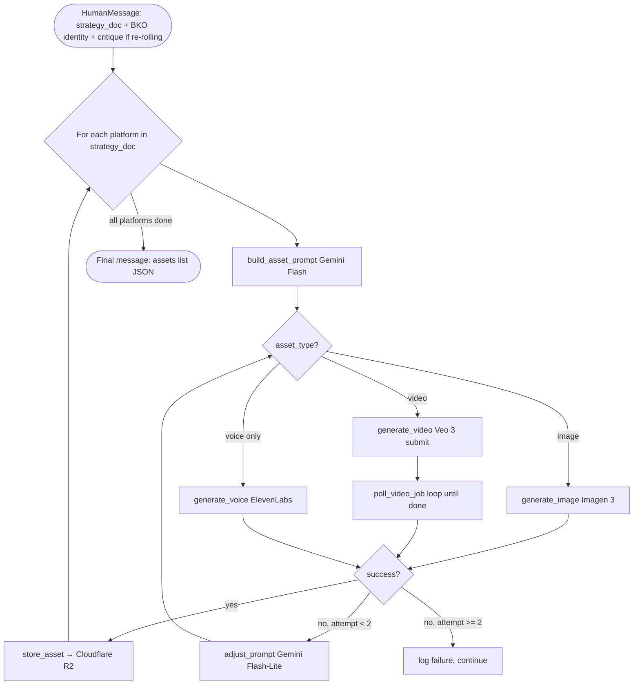

> **Veo 3 async handling**: The ReAct loop naturally handles Veo 3's async job model. The agent calls `generate_video` to submit the job (returns a `job_id`), then calls `poll_video_job` repeatedly until the job is `complete`. No special polling infrastructure needed — it's just tool calls in the ReAct loop.

---

### 8.4 Auditor Agent

**Folder**: `agents/auditor/`

**Goal**: Score every asset on three dimensions using Gemini's vision capability, produce a structured critique, and decide pass or re-roll.

#### `agents/auditor/state.py`
```python
class AuditorState(TypedDict):
    messages:      list[BaseMessage]
    asset_scores:  list[dict]       # per-asset score breakdown
    final_score:   float | None
    critique:      str | None
```

#### `agents/auditor/nodes.py` — Tool functions
- `score_asset_visual(image_url: str, bko: dict, strategy: dict)` — Gemini Flash (multimodal/vision): rates brand alignment + platform fit from the actual image
- `score_asset_copy(copy_text: str, hook: str, bko: dict)` — Gemini Flash: rates hook strength and copy quality
- `aggregate_scores(asset_scores: list[dict])` — deterministic: `0.4×brand + 0.35×hook + 0.25×platform`
- `generate_critique(asset_scores: list, bko: dict, strategy: dict)` — Gemini Flash: writes specific, actionable per-asset critique for the Producer to act on

#### `agents/auditor/graph.py`
```python
from langchain_google_genai import ChatGoogleGenerativeAI
from langgraph.prebuilt import create_react_agent
from agents.auditor.nodes import (
    score_asset_visual, score_asset_copy,
    aggregate_scores, generate_critique
)

llm = ChatGoogleGenerativeAI(model="gemini-2.0-flash", temperature=0.1)

auditor_agent = create_react_agent(
    model=llm,
    tools=[score_asset_visual, score_asset_copy,
           aggregate_scores, generate_critique],
)
```

#### `agents/auditor/prompts.py`
Injects all asset URLs, `strategy_doc`, full BKO identity + avoid list. Instructs the agent to score every asset before generating the aggregate critique.

#### Internal Flow

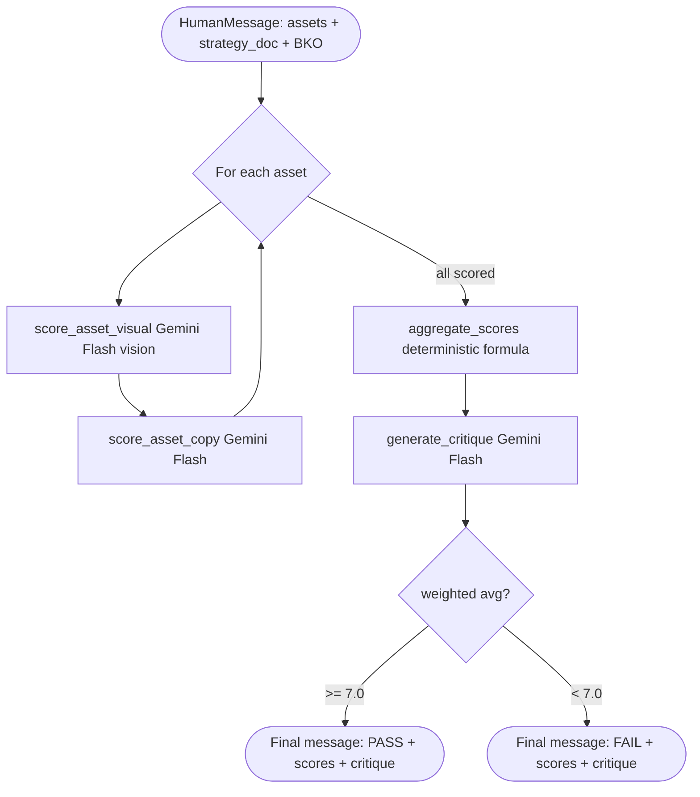

**Scoring dimensions**:

| Dimension | Weight | What it measures |
|---|---|---|
| Brand alignment | 0.40 | Tone, visual style, messaging match BKO identity and avoid list |
| Hook strength | 0.35 | First-frame / first-line attention capture quality |
| Platform fit | 0.25 | Format, pacing, aesthetic match platform norms |

---

## 9. Memory System

Three tiers. No external vector service — everything lives in PostgreSQL.

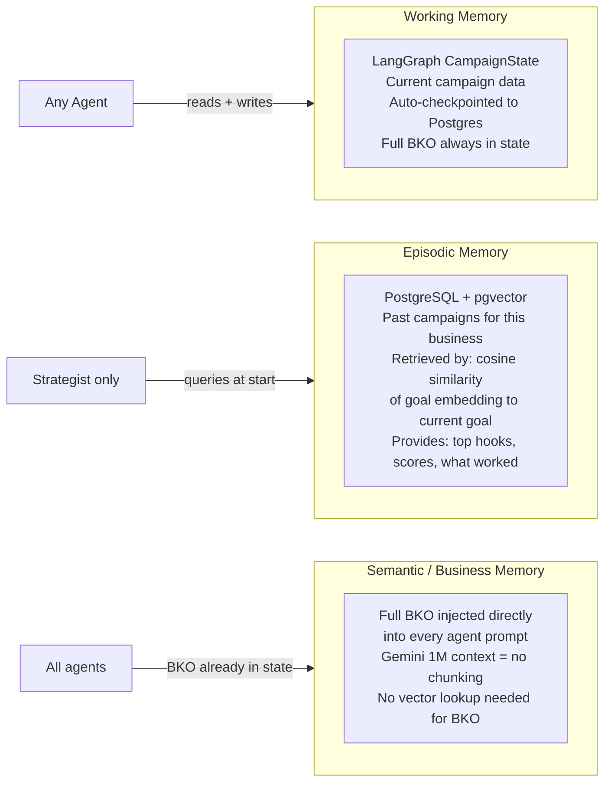

### Memory Access Per Agent

| Agent | Working Memory | Episodic | Business (BKO) |
|---|---|---|---|
| Researcher | Writes BKO | — | Uses input to build it |
| Strategist | Reads BKO, writes strategy_doc | Queries top 3 similar past campaigns via pgvector | Full BKO in prompt |
| Producer | Reads strategy_doc + critique | — | BKO.identity (tone, avoid) in prompt |
| Auditor | Reads assets + strategy_doc | — | BKO.identity in prompt |

### Post-Campaign Write-back

After every completed + user-approved campaign, append to `businesses.bko.campaign_history`:

```python
{
  "campaign_id": "uuid",
  "goal": "Free trial signups",
  "top_platform": "linkedin",
  "top_hook": "Your team is in 6 meetings a day...",
  "alignment_score": 8.4,
  "user_approved": True
}
```

Also update the pgvector embedding for this business so future episodic retrieval reflects new history.

---

## 10. Human-in-the-Loop

LangGraph's native `interrupt()` pauses the graph, persists full state to Postgres, and waits. Resuming is one API call.

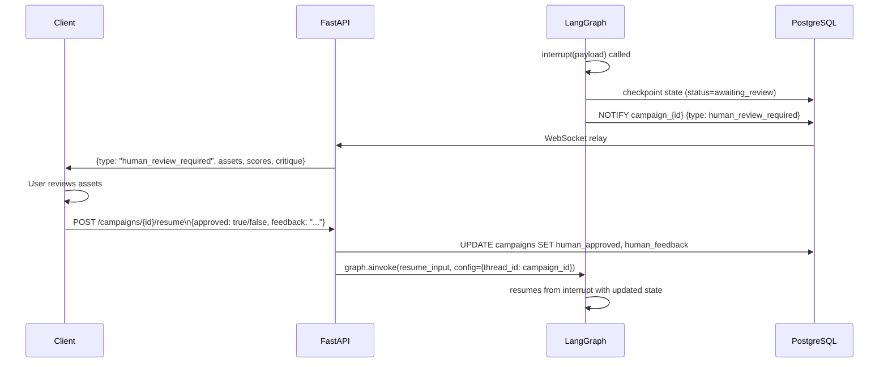

### Interrupt Points

| Where | Trigger | User sees | Resume payload |
|---|---|---|---|
| Researcher | BKO gaps after scraping | "We couldn't find your pricing — fill in these fields" | `{gaps: {field: value}}` |
| After Auditor | Score passes or retries exhausted | All assets + per-asset scores + critique | `{approved: bool, feedback: str}` |
| User-initiated (optional) | User calls `POST /campaigns/{id}/pause` | Current pipeline status | `{action: "cancel" or "continue"}` |

---

## 11. Streaming & Real-time

No Redis. Events flow through PostgreSQL `LISTEN/NOTIFY`. The campaign runner sends `NOTIFY` on every state change; the WebSocket endpoint holds an `LISTEN` connection on the same DB.

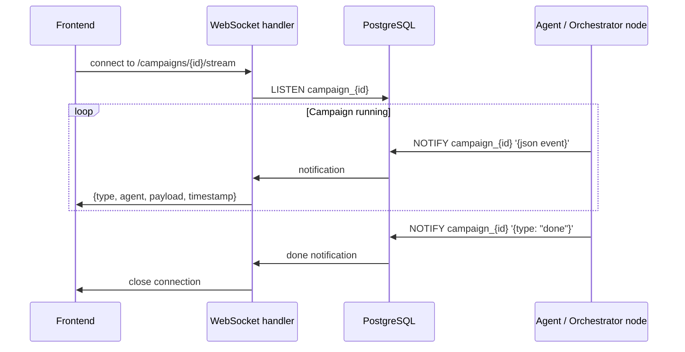

### Implementation

```python
# services/streaming_service.py

async def notify_event(campaign_id: str, event_type: str, payload: dict):
    async with get_db() as db:
        event = {"type": event_type, "payload": payload, "ts": datetime.utcnow().isoformat()}
        await db.execute(
            text(f"SELECT pg_notify(:channel, :data)"),
            {"channel": f"campaign_{campaign_id}", "data": json.dumps(event)}
        )

async def listen_campaign(campaign_id: str, websocket: WebSocket):
    async with get_raw_connection() as conn:
        await conn.execute(f"LISTEN campaign_{campaign_id}")
        while True:
            notification = await conn.wait_for_notification(timeout=30)
            if notification:
                await websocket.send_text(notification.payload)
```

### Event Types

```typescript
type StreamEvent =
  | { type: "agent_start";             agent: string }
  | { type: "tool_call";               agent: string; tool: string; input: object }
  | { type: "tool_result";             agent: string; tool: string; output: object }
  | { type: "agent_done";              agent: string; output: object }
  | { type: "human_review_required";   assets: Asset[]; score: number; critique: string }
  | { type: "campaign_done";           assets: Asset[]; score: number }
  | { type: "campaign_failed";         error: string }
```

---

## 12. Database Schema

```sql
-- Enable pgvector
CREATE EXTENSION IF NOT EXISTS vector;

-- Users
CREATE TABLE users (
    id            UUID PRIMARY KEY DEFAULT gen_random_uuid(),
    email         TEXT NOT NULL UNIQUE,
    name          TEXT NOT NULL,
    password_hash TEXT NOT NULL,
    created_at    TIMESTAMPTZ DEFAULT now()
);

-- Refresh tokens (for revocation)
CREATE TABLE refresh_tokens (
    id         UUID PRIMARY KEY DEFAULT gen_random_uuid(),
    user_id    UUID REFERENCES users(id) ON DELETE CASCADE,
    token_hash TEXT NOT NULL UNIQUE,
    expires_at TIMESTAMPTZ NOT NULL,
    revoked    BOOLEAN DEFAULT false,
    created_at TIMESTAMPTZ DEFAULT now()
);

-- Businesses
CREATE TABLE businesses (
    id          UUID PRIMARY KEY DEFAULT gen_random_uuid(),
    user_id     UUID REFERENCES users(id) ON DELETE CASCADE,
    name        TEXT NOT NULL,
    website     TEXT,
    bko         JSONB NOT NULL,
    bko_version INT DEFAULT 1,
    created_at  TIMESTAMPTZ DEFAULT now(),
    updated_at  TIMESTAMPTZ DEFAULT now()
);
CREATE INDEX idx_businesses_user ON businesses(user_id);

-- Business embeddings for past-campaign similarity search
CREATE TABLE business_embeddings (
    id           UUID PRIMARY KEY DEFAULT gen_random_uuid(),
    business_id  UUID REFERENCES businesses(id) ON DELETE CASCADE,
    campaign_id  UUID,                           -- NULL for the base BKO embedding
    content_type TEXT NOT NULL,                  -- "bko" | "campaign_summary"
    embedding    vector(768) NOT NULL,           -- Gemini text-embedding-004 dim
    metadata     JSONB,
    created_at   TIMESTAMPTZ DEFAULT now()
);
CREATE INDEX idx_embeddings_business ON business_embeddings(business_id);
CREATE INDEX idx_embeddings_vector   ON business_embeddings USING ivfflat (embedding vector_cosine_ops);

-- Campaigns
CREATE TABLE campaigns (
    id            UUID PRIMARY KEY DEFAULT gen_random_uuid(),
    business_id   UUID REFERENCES businesses(id) ON DELETE CASCADE,
    user_id       UUID REFERENCES users(id) ON DELETE CASCADE,
    goal          TEXT NOT NULL,
    platforms     TEXT[] NOT NULL,
    asset_formats JSONB,
    strategy_doc  JSONB,
    status        TEXT DEFAULT 'pending',        -- pending|running|awaiting_review|done|failed
    retry_count   INT DEFAULT 0,
    audit_score   FLOAT,
    error         TEXT,
    created_at    TIMESTAMPTZ DEFAULT now(),
    completed_at  TIMESTAMPTZ
);
CREATE INDEX idx_campaigns_business ON campaigns(business_id);
CREATE INDEX idx_campaigns_user     ON campaigns(user_id);
CREATE INDEX idx_campaigns_status   ON campaigns(status);

-- Assets
CREATE TABLE assets (
    id              UUID PRIMARY KEY DEFAULT gen_random_uuid(),
    campaign_id     UUID REFERENCES campaigns(id) ON DELETE CASCADE,
    platform        TEXT NOT NULL,
    format          TEXT NOT NULL,               -- "1:1" | "9:16" | "16:9"
    asset_type      TEXT NOT NULL,               -- "image" | "video" | "voice"
    storage_url     TEXT NOT NULL,
    prompt_used     TEXT,
    alignment_score FLOAT,
    created_at      TIMESTAMPTZ DEFAULT now()
);
CREATE INDEX idx_assets_campaign ON assets(campaign_id);

-- Audit logs (one row per asset per audit iteration)
CREATE TABLE audit_logs (
    id             UUID PRIMARY KEY DEFAULT gen_random_uuid(),
    asset_id       UUID REFERENCES assets(id) ON DELETE CASCADE,
    campaign_id    UUID REFERENCES campaigns(id) ON DELETE CASCADE,
    iteration      INT NOT NULL,
    brand_score    FLOAT,
    hook_score     FLOAT,
    platform_score FLOAT,
    weighted_avg   FLOAT,
    critique       TEXT,
    created_at     TIMESTAMPTZ DEFAULT now()
);

-- Human review sessions
CREATE TABLE human_reviews (
    id             UUID PRIMARY KEY DEFAULT gen_random_uuid(),
    campaign_id    UUID REFERENCES campaigns(id) ON DELETE CASCADE,
    interrupt_type TEXT NOT NULL,                -- "bko_gap" | "asset_approval" | "user_pause"
    payload        JSONB,
    approved       BOOLEAN,
    feedback       TEXT,
    created_at     TIMESTAMPTZ DEFAULT now(),
    resolved_at    TIMESTAMPTZ
);
```

---

## 13. API Reference

### Auth

```
POST   /auth/signup              Register new user → {access_token, refresh_token, user}
POST   /auth/login               Login → {access_token, refresh_token, user}
POST   /auth/refresh             New access token from refresh token
POST   /auth/logout              Revoke refresh token
GET    /auth/me                  Current user profile
```

### Businesses

```
POST   /businesses               Onboard a business (triggers BKO build via Researcher)
GET    /businesses               List user's businesses
GET    /businesses/{id}          Business detail + BKO
PUT    /businesses/{id}          Update business metadata
POST   /businesses/{id}/refresh  Re-scrape website, rebuild + re-embed BKO
DELETE /businesses/{id}          Delete business + cascade (campaigns, embeddings)
```

### Campaigns

```
POST   /campaigns                Launch a campaign → {campaign_id} immediately
GET    /campaigns                List campaigns (filter: business_id, status)
GET    /campaigns/{id}           Campaign detail + strategy_doc + final assets
GET    /campaigns/{id}/events    Full event log for debugging / audit trail
POST   /campaigns/{id}/resume    Resume after human-in-the-loop interrupt
POST   /campaigns/{id}/pause     Pause a running campaign (triggers interrupt)
DELETE /campaigns/{id}           Cancel + delete campaign
```

### Streaming

```
WS     /campaigns/{id}/stream    Live event stream (backed by Postgres LISTEN)
```

### Assets

```
GET    /campaigns/{id}/assets    All assets for a campaign
GET    /assets/{id}              Single asset metadata
```

---

## 14. Directory Structure

```
adgen/
│
├── api/                                    # Transport layer only
│   ├── main.py                             # FastAPI app factory, CORS, middleware
│   ├── dependencies.py                     # get_current_user, get_db
│   ├── middleware/
│   │   ├── auth.py                         # JWT decode middleware
│   │   └── rate_limit.py
│   └── routes/
│       ├── auth.py
│       ├── businesses.py
│       ├── campaigns.py
│       ├── assets.py
│       └── stream.py                       # WebSocket → Postgres LISTEN relay
│
├── orchestrator/                           # Thin LangGraph graph — no LLM
│   ├── graph.py                            # build_graph() → compiled StateGraph
│   ├── state.py                            # CampaignState TypedDict
│   ├── nodes.py                            # run_researcher, run_strategist, run_producer, run_auditor, human_review
│   ├── edges.py                            # route_after_audit(), route_after_review()
│   └── checkpointer.py                     # AsyncPostgresSaver setup
│
├── agents/
│   ├── researcher/
│   │   ├── graph.py                        # create_react_agent with tools
│   │   ├── state.py                        # ResearcherState TypedDict
│   │   ├── nodes.py                        # scrape_website, structure_bko, validate_bko, request_clarification
│   │   └── prompts.py                      # build_input(campaign_state) → str
│   │
│   ├── strategist/
│   │   ├── graph.py
│   │   ├── state.py                        # StrategistState TypedDict
│   │   ├── nodes.py                        # get_past_campaigns, reason_about_audience, generate_strategy, self_critique, revise_strategy
│   │   └── prompts.py
│   │
│   ├── producer/
│   │   ├── graph.py
│   │   ├── state.py                        # ProducerState TypedDict
│   │   ├── nodes.py                        # build_asset_prompt, generate_image, generate_video, poll_video_job, generate_voice, store_asset, adjust_prompt
│   │   └── prompts.py
│   │
│   └── auditor/
│       ├── graph.py
│       ├── state.py                        # AuditorState TypedDict
│       ├── nodes.py                        # score_asset_visual, score_asset_copy, aggregate_scores, generate_critique
│       └── prompts.py
│
├── tools/                                  # Thin wrappers around external APIs
│   ├── firecrawl.py                        # scrape_website implementation
│   ├── gemini.py                           # LiteLLM client configured for Gemini Flash / Flash-Lite
│   ├── imagen.py                           # Imagen 3 image generation (Google AI)
│   ├── veo.py                              # Veo 3 video generation + job polling (Google AI)
│   ├── elevenlabs.py                       # ElevenLabs voice generation
│   └── r2.py                               # Cloudflare R2 upload via boto3
│
├── memory/
│   ├── episodic.py                         # get_similar_campaigns(business_id, goal_embedding, n=3)
│   └── embeddings.py                       # embed_text(text) → vector using Gemini text-embedding-004
│
├── services/
│   ├── auth_service.py                     # hash_password, verify_password, create_tokens, revoke_token
│   ├── business_service.py                 # onboard_business(), refresh_bko(), embed_bko()
│   ├── campaign_service.py                 # create_campaign(), update_status(), write_memory_writeback()
│   └── streaming_service.py               # notify_event(), listen_campaign() — Postgres LISTEN/NOTIFY
│
├── tasks/
│   └── campaign_runner.py                  # BackgroundTask: loads graph, calls ainvoke, handles errors
│
├── db/
│   ├── models.py                           # SQLAlchemy ORM: User, RefreshToken, Business, BusinessEmbedding, Campaign, Asset, AuditLog, HumanReview
│   ├── session.py                          # Async engine + AsyncSession factory
│   └── migrations/
│       ├── env.py
│       └── versions/
│
├── schemas/
│   ├── auth.py                             # SignupRequest, LoginRequest, TokenResponse, UserResponse
│   ├── business.py                         # BusinessCreate, BusinessResponse
│   ├── campaign.py                         # CampaignCreate, CampaignResponse, ResumeRequest
│   ├── asset.py                            # AssetResponse
│   ├── bko.py                              # BKO Pydantic model (validates BKO shape)
│   └── events.py                           # StreamEvent union type
│
├── config.py                               # Pydantic BaseSettings: DB, Google AI key, ElevenLabs key, R2 creds, JWT
├── docker-compose.yml                      # postgres (pgvector image) + app — two services only
├── requirements.txt
├── alembic.ini
└── tests/
    ├── conftest.py                         # DB fixtures, test client, mock Gemini responses
    ├── test_api/
    │   ├── test_auth.py
    │   ├── test_businesses.py
    │   └── test_campaigns.py
    ├── test_orchestrator/
    │   ├── test_graph.py
    │   └── test_nodes.py
    ├── test_agents/
    │   ├── test_researcher.py
    │   ├── test_strategist.py
    │   ├── test_producer.py
    │   └── test_auditor.py
    └── test_tools/
        ├── test_imagen.py
        ├── test_veo.py
        └── test_r2.py
```

---

## 15. Implementation Order

### Phase 1 — Foundation (Week 1-2)
Goal: Auth, DB, and a stub campaign endpoint. Nothing AI yet.

- [ ] `docker-compose.yml` — single Postgres container with `pgvector/pgvector:pg16` image
- [ ] All DB tables + pgvector extension via Alembic migrations
- [ ] FastAPI skeleton with JWT auth (signup, login, refresh, logout, me)
- [ ] `POST /businesses` — saves row, no BKO yet
- [ ] `POST /campaigns` — creates row, fires empty BackgroundTask, returns `campaign_id`
- [ ] `GET /campaigns/{id}/events` — returns empty list

**Checkpoint**: Signup → login → create business → launch campaign → see empty event log. Zero AI.

### Phase 2 — Orchestrator Shell (Week 3-4)
Goal: LangGraph pipeline runs end-to-end with stub agents.

- [ ] `CampaignState` TypedDict in `orchestrator/state.py`
- [ ] Four stub agents — each `graph.py` returns a hardcoded JSON final message, no LLM
- [ ] `build_graph()` with all nodes, edges, routing functions
- [ ] `AsyncPostgresSaver` checkpointing wired up
- [ ] `streaming_service.py` — `NOTIFY` in nodes, `LISTEN` in WebSocket handler
- [ ] WebSocket `/campaigns/{id}/stream` relays Postgres notifications

**Checkpoint**: Full pipeline runs through all 4 stub agents, checkpoints after each, streams events to WebSocket.

### Phase 3 — Real Agents (Week 5-7)
Goal: Replace stubs one by one. Test each in isolation first.

- [ ] `tools/firecrawl.py` + `tools/gemini.py` (LiteLLM → Gemini Flash)
- [ ] Researcher: Firecrawl + Gemini structuring + BKO validation
- [ ] `memory/embeddings.py` + `memory/episodic.py` (pgvector)
- [ ] Strategist: pgvector past campaign lookup + self-critique loop
- [ ] `tools/imagen.py` — Imagen 3 image generation
- [ ] Producer: image generation + R2 storage (images only first)
- [ ] Auditor: Gemini Flash vision scoring + critique + retry routing

**Checkpoint**: End-to-end image campaign runs for a real business. Assets stored in R2.

### Phase 4 — Human-in-the-Loop (Week 8)
- [ ] `interrupt()` in Researcher node (BKO gap filling)
- [ ] `interrupt()` in `human_review` node (asset approval)
- [ ] `POST /campaigns/{id}/resume` endpoint
- [ ] Frontend: asset review UI consuming WebSocket events

**Checkpoint**: User can review generated ads and approve or reject with feedback.

### Phase 5 — Video + Voice (Week 9-10)
- [ ] `tools/veo.py` — Veo 3 submit + poll pattern
- [ ] `tools/elevenlabs.py` — standalone voiceover
- [ ] Producer handles mixed asset types per platform

### Phase 6 — Memory Enrichment (Week 11)
- [ ] Post-campaign write-back to `businesses.bko.campaign_history`
- [ ] Re-embed BKO after write-back
- [ ] `POST /businesses/{id}/refresh` endpoint (re-scrape + re-embed)
- [ ] BKO cleanup on business deletion

### Phase 7 — Hardening + Evaluation (Week 12-14)
- [ ] Timeout + fallback on every external API call (Firecrawl, Imagen, Veo, ElevenLabs)
- [ ] Cost logging per campaign (token counts + generation API calls)
- [ ] Run 10 test businesses end-to-end
- [ ] A/B evaluation: AdGen output vs single-prompt baseline
- [ ] Latency profiling per agent
- [ ] Write dissertation evaluation section
