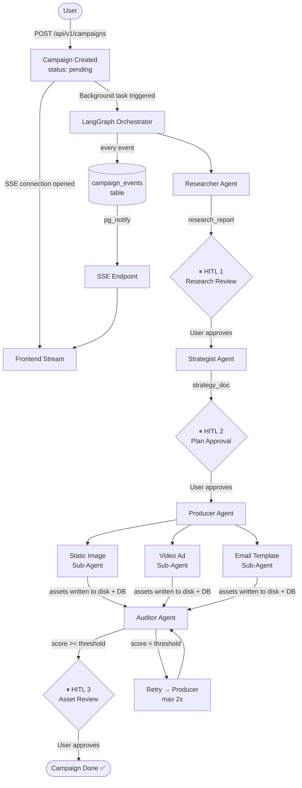
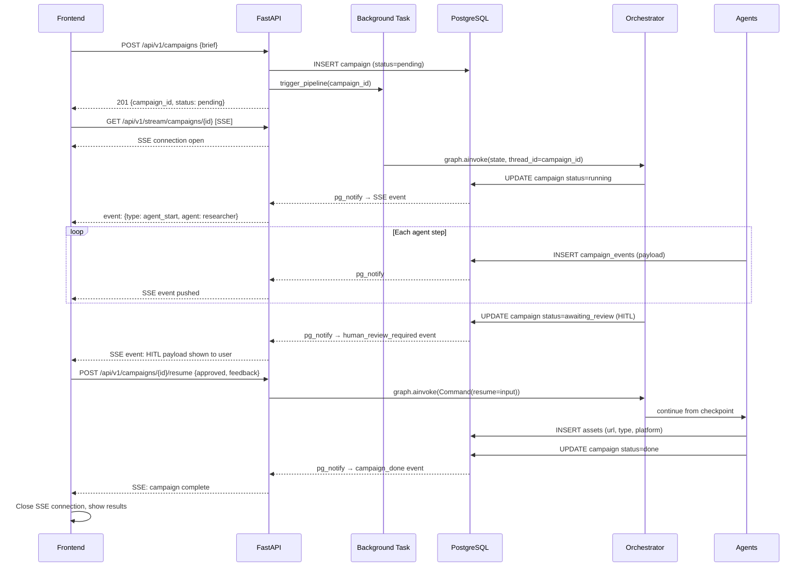
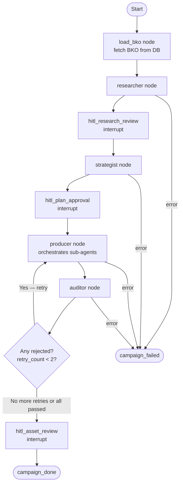
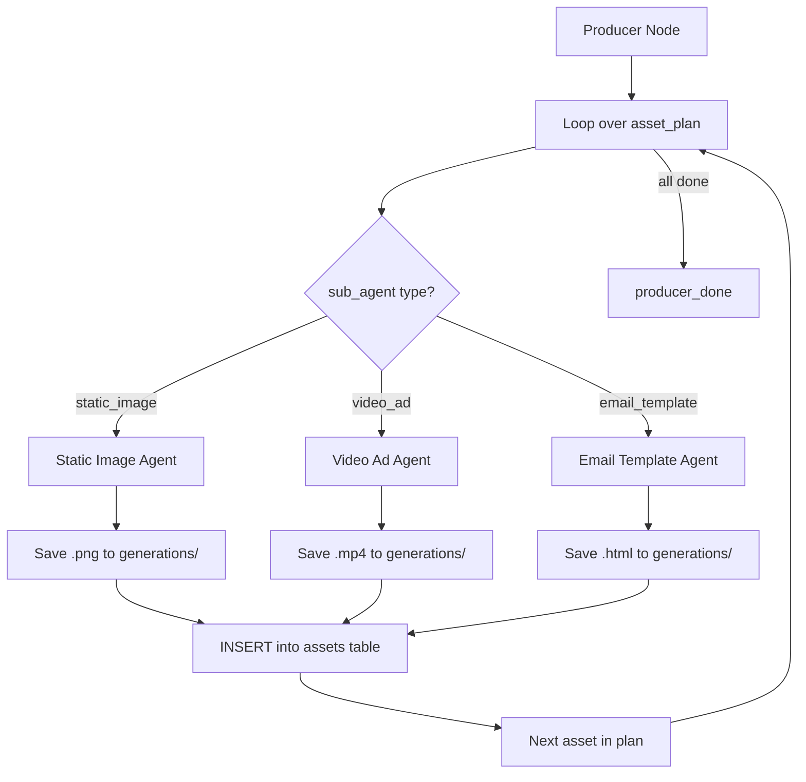
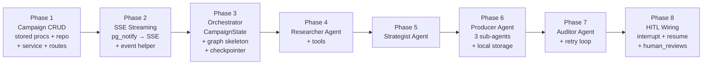

# AdGen-Agentic — Campaign Pipeline (What We're Building Next)

> Implementation plan for the full campaign generation pipeline.  
> Covers: Campaign CRUD → SSE Streaming → LangGraph Orchestrator → 4 Agents → HITL → Local Storage.  
> For what's already built, see [BUILT_SO_FAR.md](./BUILT_SO_FAR.md).

---

## Table of Contents

1. [System Overview](#1-system-overview)
2. [Campaign Input — What the User Provides](#2-campaign-input--what-the-user-provides)
3. [End-to-End Flow](#3-end-to-end-flow)
4. [Phase 1 — Campaign CRUD Layer](#4-phase-1--campaign-crud-layer)
5. [Phase 2 — Streaming Infrastructure](#5-phase-2--streaming-infrastructure)
6. [Phase 3 — LangGraph Orchestrator](#6-phase-3--langgraph-orchestrator)
7. [Phase 4 — Researcher Agent](#7-phase-4--researcher-agent)
8. [Phase 5 — Strategist Agent](#8-phase-5--strategist-agent)
9. [Phase 6 — Producer Agent & Sub-Agents](#9-phase-6--producer-agent--sub-agents)
10. [Phase 7 — Auditor Agent](#10-phase-7--auditor-agent)
11. [Human-in-the-Loop (HITL)](#11-human-in-the-loop-hitl)
12. [Local Asset Storage](#12-local-asset-storage)
13. [API Endpoints (Full Reference)](#13-api-endpoints-full-reference)
14. [Build Order](#14-build-order)

---

## 1. System Overview

Once a user has onboarded their business (BKO created), they can launch campaigns. A campaign is a request to generate a set of ad assets for a specific goal, platform, and funnel stage. The system runs a four-agent pipeline autonomously — but the user stays in the loop at three critical decision points, watching the work happen in real time via a live event stream.



---

## 2. Campaign Input — What the User Provides

The BKO already contains 90% of what the agents need. The campaign brief is just the **lens** — it tells agents *which slice* of the BKO to focus on and *how* to frame the output.

### Required Fields

| Field | Type | Values | Purpose |
|---|---|---|---|
| `name` | string (optional) | Any text | Label for organisation. Auto-generated if blank: `"Awareness Push — Instagram — Jun 2026"` |
| `objective` | enum (required) | `awareness` `traffic` `conversion` `lead_gen` `engagement` | Determines hook style, CTA type, bidding intent |
| `platforms` | string[] (required, min 1) | `instagram` `facebook` `tiktok` `youtube` `google` `linkedin` | Determines format specs, character limits, visual ratios |
| `funnel_stage` | enum (required) | `tofu` `mofu` `bofu` `balanced` | Determines messaging depth and urgency |
| `num_variants` | int (required) | 1–10, default 3 | How many total ad units to produce |
| `special_brief` | string (optional, max 300 chars) | Free text | User's editorial override: "Focus on Eid gifting angle" / "Lead with sea buckthorn" |

### What NOT to Ask

The following are already in the BKO and should **never** appear in the campaign form:
- Brand voice / tone
- Competitor names or angles
- Visual style / colors
- Audience demographics
- Compliance rules
- What copy to write (that's the Producer's job)

---

## 3. End-to-End Flow



---

## 4. Phase 1 — Campaign CRUD Layer

Same router → service → repo → stored procedure pattern as businesses.

### 4.1 Stored Procedures (`sql/campaign/`)

**`sp_create_campaign.sql`**
```sql
CREATE OR REPLACE FUNCTION sp_create_campaign(
    p_user_id       UUID,
    p_business_id   UUID,
    p_name          TEXT,
    p_objective     TEXT,
    p_platforms     TEXT[],
    p_funnel_stage  TEXT,
    p_num_variants  INT,
    p_special_brief TEXT
)
RETURNS SETOF campaigns
```
Inserts campaign with `status = 'pending'`. Returns the full row.

---

**`sp_get_campaign_by_id.sql`**
```sql
CREATE OR REPLACE FUNCTION sp_get_campaign_by_id(
    p_campaign_id UUID,
    p_user_id     UUID
)
RETURNS SETOF campaigns
```
Returns campaign row only if `user_id` matches — ownership enforced in SQL.

---

**`sp_get_campaigns_by_business.sql`**
```sql
CREATE OR REPLACE FUNCTION sp_get_campaigns_by_business(
    p_business_id UUID,
    p_user_id     UUID
)
RETURNS SETOF campaigns
```
Returns all campaigns for a business, ordered by `created_at DESC`.

---

**`sp_update_campaign_status.sql`**
```sql
CREATE OR REPLACE FUNCTION sp_update_campaign_status(
    p_campaign_id    UUID,
    p_status         TEXT,
    p_strategy_doc   JSONB DEFAULT NULL,
    p_audit_score    FLOAT DEFAULT NULL,
    p_error          TEXT  DEFAULT NULL
)
RETURNS SETOF campaigns
```
Called by agents to update campaign state. Sets `completed_at` when status is `done` or `failed`.

---

**`sp_get_campaign_events.sql`**
```sql
CREATE OR REPLACE FUNCTION sp_get_campaign_events(
    p_campaign_id UUID,
    p_after_seq   BIGINT DEFAULT 0
)
RETURNS SETOF campaign_events
```
Returns events for a campaign ordered by `seq`. `after_seq` lets the client catch up after reconnect.

---

**`sp_insert_campaign_event.sql`**
```sql
CREATE OR REPLACE FUNCTION sp_insert_campaign_event(
    p_campaign_id UUID,
    p_event_type  TEXT,
    p_agent       TEXT,
    p_payload     JSONB
)
RETURNS SETOF campaign_events
```
Inserts event row AND fires `pg_notify('campaign_' || p_campaign_id, row_json)`. The notify is inside this proc — agents never call `pg_notify` directly.

---

**`sp_create_asset.sql`**
```sql
CREATE OR REPLACE FUNCTION sp_create_asset(
    p_campaign_id UUID,
    p_platform    TEXT,
    p_format      TEXT,
    p_asset_type  TEXT,
    p_storage_url TEXT,
    p_prompt_used TEXT
)
RETURNS SETOF assets
```

---

**`sp_update_asset_status.sql`**
```sql
CREATE OR REPLACE FUNCTION sp_update_asset_status(
    p_asset_id UUID,
    p_status   TEXT
)
RETURNS SETOF assets
```

---

### 4.2 Repo (`repos/campaign_repo.py`)

```python
def create(db, *, user_id, business_id, name, objective,
           platforms, funnel_stage, num_variants, special_brief) -> dict

def get_by_id(db, campaign_id, user_id) -> dict | None

def get_by_business(db, business_id, user_id) -> list[dict]

def update_status(db, *, campaign_id, status,
                  strategy_doc=None, audit_score=None, error=None) -> dict

def get_events(db, campaign_id, after_seq=0) -> list[dict]

def insert_event(db, *, campaign_id, event_type, agent, payload) -> dict

def create_asset(db, *, campaign_id, platform, format,
                 asset_type, storage_url, prompt_used) -> dict

def update_asset_status(db, *, asset_id, status) -> dict
```

---

### 4.3 Schemas (`schemas/campaign.py`)

```python
class CreateCampaignRequest(BaseModel):
    business_id:    UUID
    name:           Optional[str] = None
    objective:      Literal["awareness", "traffic", "conversion", "lead_gen", "engagement"]
    platforms:      list[Literal["instagram", "facebook", "tiktok", "youtube", "google", "linkedin"]]
    funnel_stage:   Literal["tofu", "mofu", "bofu", "balanced"]
    num_variants:   int = Field(default=3, ge=1, le=10)
    special_brief:  Optional[str] = Field(default=None, max_length=300)

class ResumeRequest(BaseModel):
    approved:   bool
    feedback:   Optional[str] = None   # user notes on what to change

class CampaignResponse(BaseModel):
    id:             UUID
    business_id:    UUID
    user_id:        UUID
    name:           Optional[str]
    objective:      str
    platforms:      list[str]
    funnel_stage:   str
    num_variants:   int
    special_brief:  Optional[str]
    status:         str
    strategy_doc:   Optional[dict]
    audit_score:    Optional[float]
    error:          Optional[str]
    created_at:     datetime
    updated_at:     datetime
    completed_at:   Optional[datetime]
```

---

### 4.4 Service (`services/campaign_service.py`)

```python
def create(db, data: CreateCampaignRequest, user_id) -> CampaignResponse:
    # 1. verify business exists and belongs to user
    # 2. insert campaign record
    # 3. trigger background task: run_pipeline(campaign_id)
    # 4. return CampaignResponse

def get_one(db, campaign_id, user_id) -> CampaignResponse

def get_all(db, business_id, user_id) -> list[CampaignResponse]

def resume(db, campaign_id, user_id, data: ResumeRequest) -> CampaignResponse:
    # 1. verify campaign is in awaiting_review
    # 2. call orchestrator: graph.invoke(Command(resume=data))
    # 3. return updated CampaignResponse
```

---

### 4.5 Routes (`api/routes/campaigns.py`)

```python
POST   /api/v1/campaigns                         → create_campaign
GET    /api/v1/campaigns?business_id={id}        → list_campaigns
GET    /api/v1/campaigns/{id}                    → get_campaign
POST   /api/v1/campaigns/{id}/resume             → resume_campaign  (HITL)
DELETE /api/v1/campaigns/{id}                    → delete_campaign
```

---

## 5. Phase 2 — Streaming Infrastructure

### 5.1 How it Works

```
Agent calls insert_event(campaign_id, event_type, agent, payload)
        ↓
sp_insert_campaign_event runs INSERT + pg_notify
        ↓
pg_notify('campaign_{id}', json_payload)
        ↓
FastAPI SSE endpoint is LISTENING on that channel (psycopg2 async connection)
        ↓
SSE frame pushed to client:
    data: {"type": "tool_call", "agent": "researcher", "payload": {...}}\n\n
        ↓
Frontend renders in real-time
```

### 5.2 SSE Endpoint (`api/routes/stream.py`)

```python
GET /api/v1/stream/campaigns/{campaign_id}
```

- Uses a dedicated async `psycopg2` connection (not the session pool)
- Calls `LISTEN campaign_{id}` on connect
- Yields SSE frames as `pg_notify` messages arrive
- Sends a heartbeat every 15s to keep the connection alive
- On `campaign_done` or `campaign_failed` event → sends final frame + closes

### 5.3 Event Schema (`schemas/events.py`)

Every event written to `campaign_events` and streamed via SSE follows this shape:

```python
class CampaignEvent(BaseModel):
    campaign_id:  UUID
    seq:          int           # monotonic, for ordering
    event_type:   Literal[
        "agent_start",
        "tool_call",
        "tool_result",
        "agent_done",
        "human_review_required",
        "campaign_done",
        "campaign_failed",
    ]
    agent:        Optional[Literal[
        "researcher", "strategist", "producer", "auditor", "system"
    ]]
    payload:      dict          # event-specific data (see below)
    created_at:   datetime
```

### 5.4 Payload Shapes Per Event Type

| event_type | payload content |
|---|---|
| `agent_start` | `{message: "Researcher starting — analysing BKO..."}` |
| `tool_call` | `{tool: "web_search", input: "competitor jams ads instagram 2026"}` |
| `tool_result` | `{tool: "web_search", result_summary: "Found 12 relevant ads..."}` |
| `agent_done` | `{summary: "Research complete. Found 3 trending hooks.", output_key: "research_report"}` |
| `human_review_required` | `{interrupt_type: "strategy_approval", data: <strategy_doc or research summary>}` |
| `campaign_done` | `{asset_count: 5, avg_audit_score: 8.7}` |
| `campaign_failed` | `{error: "Producer failed after 2 retries on video asset"}` |

---

## 6. Phase 3 — LangGraph Orchestrator

### 6.1 CampaignState

The shared object that flows through every node. Every agent reads from it and writes its output back to it.

```python
class CampaignState(TypedDict):
    # ── Set at launch, never changed ──────────────────────────────
    campaign_id:      str
    business_id:      str
    user_id:          str
    bko:              dict          # full BKO loaded from DB at pipeline start
    objective:        str
    platforms:        list[str]
    funnel_stage:     str
    num_variants:     int
    special_brief:    str | None

    # ── Written by Researcher ──────────────────────────────────────
    research_report:  dict | None

    # ── Written by Strategist ──────────────────────────────────────
    strategy_doc:     dict | None   # also persisted to campaigns.strategy_doc

    # ── Written by Producer ───────────────────────────────────────
    generated_assets: list[dict]    # one entry per produced asset

    # ── Written by Auditor ────────────────────────────────────────
    audit_results:    list[dict]
    assets_approved:  list[str]     # asset_ids that passed
    assets_rejected:  list[str]     # asset_ids that need retry

    # ── Retry tracking ────────────────────────────────────────────
    retry_count:      int           # current retry iteration (max 2)

    # ── HITL ──────────────────────────────────────────────────────
    hitl_payload:     dict | None   # what was shown to the user
    hitl_response:    dict | None   # user's approved/feedback

    # ── Error tracking ────────────────────────────────────────────
    error:            str | None
```

### 6.2 Graph Structure



### 6.3 Checkpointer

Uses `langgraph-checkpoint-postgres` with the `adgen` database. The `campaign.id` UUID is used directly as `thread_id`.

```python
from langgraph.checkpoint.postgres import PostgresSaver

checkpointer = PostgresSaver.from_conn_string(settings.DATABASE_URL)
graph = orchestrator_graph.compile(checkpointer=checkpointer)

# Launch
await graph.ainvoke(
    initial_state,
    config={"configurable": {"thread_id": str(campaign_id)}}
)

# Resume after HITL
await graph.ainvoke(
    Command(resume=hitl_response),
    config={"configurable": {"thread_id": str(campaign_id)}}
)
```

LangGraph auto-creates `checkpoints`, `checkpoint_blobs`, `checkpoint_writes` tables. Do not create these manually.

### 6.4 Event Helper

Every node calls this before and after significant steps:

```python
async def emit(db, campaign_id, event_type, agent, payload):
    campaign_repo.insert_event(db,
        campaign_id=campaign_id,
        event_type=event_type,
        agent=agent,
        payload=payload,
    )
    # pg_notify fires inside sp_insert_campaign_event
```

---

## 7. Phase 4 — Researcher Agent

### Responsibility

Gather **campaign-specific** external intelligence that is NOT in the BKO. The BKO describes the business. The Research Report describes the *current landscape* for this specific campaign.

### Inputs (from CampaignState)

- `bko` — to understand the business, product, audience, and competitors
- `objective` — what the campaign is trying to achieve
- `platforms` — which platforms to research
- `funnel_stage` — what stage of the funnel
- `special_brief` — any specific angle the user wants

### Tools Available

| Tool | Purpose |
|---|---|
| `web_search` | Search for competitor ads, trending content, platform updates |
| `platform_trends` | Fetch trending hook patterns and format performance for the target platforms |
| `seasonal_context` | Determine if there are upcoming events, holidays, or cultural moments relevant to the business's geography/industry |

### Output — Research Report Schema

```python
class ResearchReport(TypedDict):
    competitor_ad_patterns: list[dict]     # what competitors are running right now
    trending_hooks:         list[str]      # top-performing hooks on target platforms
    platform_specs:         dict           # char limits, video lengths, aspect ratios per platform
    seasonal_context:       list[dict]     # upcoming events: {event, date, relevance}
    audience_insights:      list[str]      # current behavioral trends for target audience
    recommended_angles:     list[str]      # 3-5 suggested campaign angles with rationale
    raw_sources:            list[str]      # URLs or sources used
```

### Events Emitted

```
agent_start    → "Researcher starting — analysing campaign brief and BKO"
tool_call      → {tool: "web_search", input: "..."}
tool_result    → {tool: "web_search", summary: "..."}
tool_call      → {tool: "platform_trends", input: "instagram conversion 2026"}
tool_result    → {tool: "platform_trends", summary: "..."}
agent_done     → {summary: "Research complete. 3 trending angles identified.", output_key: "research_report"}
```

### HITL After Researcher

```
interrupt_type: "research_review"
data:
  - competitor_patterns summary
  - trending hooks list
  - seasonal context
  - recommended angles

User sees: "Here's what I found. Does this look right?"
User can:  Approve → continue   |   Add note → "also focus on the health angle"
```

---

## 8. Phase 5 — Strategist Agent

### Responsibility

Consume the BKO + Research Report and produce the **complete campaign plan** — a precise blueprint that tells the Producer exactly what to create. After Strategist runs, no creative decisions remain. Producer just executes.

### Inputs

- `bko` — full business knowledge
- `research_report` — what Researcher found
- `objective`, `platforms`, `funnel_stage`, `num_variants`, `special_brief`

### Output — Strategy Document Schema

```python
class AssetPlan(TypedDict):
    asset_id:       str            # temporary ID used during planning
    sub_agent:      Literal["static_image", "video_ad", "email_template"]
    platform:       str
    format:         str            # "9:16", "1:1", "4:5", "email"
    funnel_stage:   str            # tofu / mofu / bofu
    hook:           str            # opening line or first-frame direction
    angle:          str            # e.g. "nostalgia + health guilt"
    key_message:    str            # the single most important thing this asset must communicate
    cta:            str            # call to action
    visual_brief:   str            # what the image/video should show
    copy_notes:     str            # tone, style, length guidance for Producer

class StrategyDoc(TypedDict):
    campaign_goal:       str
    overall_angle:       str            # the single creative thread across all assets
    funnel_distribution: dict           # {"tofu": 2, "mofu": 2, "bofu": 1}
    asset_plan:          list[AssetPlan]  # one entry per asset to produce
    platform_notes:      dict           # platform-specific guidance
    key_messages:        list[str]      # top 3 messages across the full campaign
    what_to_avoid:       list[str]      # from BKO compliance + brand donts
```

### Events Emitted

```
agent_start  → "Strategist starting — planning campaign structure"
tool_result  → "Analysing research report..."
tool_result  → "Distributing assets across funnel stages..."
tool_result  → "Assigning hooks and angles..."
agent_done   → {asset_count: 5, distribution: {tofu:2, mofu:2, bofu:1}}
```

### HITL After Strategist

```
interrupt_type: "plan_approval"
data: full strategy_doc

User sees the full asset plan:
  "I'm going to create:
   • 2 Instagram Reels (TOFU — nostalgia angle)
   • 1 TikTok video (MOFU — health angle)
   • 1 Instagram static post (BOFU — limited stock CTA)
   • 1 Email template (BOFU — abandoned cart sequence)"

User can: Approve → Producer starts  |  Reject + feedback → Strategist re-plans
```

---

## 9. Phase 6 — Producer Agent & Sub-Agents

### Responsibility

Execute the `strategy_doc.asset_plan` one asset at a time. For each asset, route to the correct sub-agent, generate the asset, save it to local storage, and record it in the DB.

### How Producer Orchestrates Sub-Agents



---

### 9.1 Static Image Sub-Agent

**Input:** `AssetPlan` entry with `sub_agent = "static_image"`

**Process:**
1. Build image generation prompt from: `hook`, `visual_brief`, `BKO.brand.visual_identity`, `platform`, `format`
2. Call image generation model (Google Imagen 3 via Gemini API)
3. Save image to `generations/{campaign_id}/static/{asset_id}.png`
4. Save asset row to DB with `storage_url = "generations/{campaign_id}/static/{asset_id}.png"`

**Output per asset:**
```python
{
    "asset_id":       "uuid",
    "type":           "static_image",
    "platform":       "instagram",
    "format":         "1:1",
    "headline":       "Your jam has 12 ingredients you can't pronounce. Ours has two.",
    "body_copy":      "Wild apricots. Cane sugar. That's it...",
    "cta":            "Order now — free delivery over PKR 2,000",
    "image_prompt":   "Warm natural light, Hunza apricot orchard...",
    "storage_url":    "generations/{campaign_id}/static/{asset_id}.png",
    "status":         "stored"
}
```

---

### 9.2 Video Ad Sub-Agent

**Input:** `AssetPlan` entry with `sub_agent = "video_ad"`

**Process:**
1. Write complete video script: hook (0–3s), story (3–20s), CTA (20–27s), voiceover notes
2. Build video generation prompt from script + `visual_brief` + `BKO.brand.visual_identity`
3. Call video generation model (Google Veo 3 via Gemini API)
4. Save video to `generations/{campaign_id}/video/{asset_id}.mp4`
5. Save asset row to DB

**Output per asset:**
```python
{
    "asset_id":         "uuid",
    "type":             "video_ad",
    "platform":         "tiktok",
    "format":           "9:16",
    "script": {
        "hook":         "0-3s: Close-up of golden Hunza apricot being bitten...",
        "story":        "3-20s: Voiceover: 'In Hunza, fruit grows at 2,500 metres...'",
        "cta":          "20-27s: Jar on rustic table. Text overlay: Order Yours Today"
    },
    "voiceover_notes":  "Warm, unhurried female voice. Urdu accent welcome.",
    "video_prompt":     "Drone shot of Hunza valley at golden hour...",
    "storage_url":      "generations/{campaign_id}/video/{asset_id}.mp4",
    "status":           "stored"
}
```

---

### 9.3 Email Template Sub-Agent

**Input:** `AssetPlan` entry with `sub_agent = "email_template"`

**Process:**
1. Write complete email: subject line, preview text, headline, body sections, CTA button
2. Render as styled HTML (inline CSS, mobile-first)
3. Save HTML file to `generations/{campaign_id}/email/{asset_id}.html`
4. Save asset row to DB with `asset_type = "voice"` — **NOTE:** extend `asset_type` CHECK constraint to include `"email"` before implementing

**Output per asset:**
```python
{
    "asset_id":       "uuid",
    "type":           "email_template",
    "platform":       "email",
    "format":         "email",
    "subject_line":   "This apricot grew at 2,500m. Your toast deserves it.",
    "preview_text":   "Hand-crafted in Hunza. No preservatives. Ever.",
    "headline":       "From the valleys of Karakoram, straight to your table",
    "body_sections":  [...],
    "cta_text":       "Order Your Jar",
    "cta_url":        "https://karakoramkitchen.pk/shop",
    "storage_url":    "generations/{campaign_id}/email/{asset_id}.html",
    "status":         "stored"
}
```

---

### 9.4 Events Emitted by Producer

```
agent_start   → "Producer starting — 5 assets to generate"
tool_call     → {tool: "static_image_agent", asset_id: "...", platform: "instagram"}
tool_result   → {asset_id: "...", status: "stored", url: "generations/.../...png"}
tool_call     → {tool: "video_ad_agent", asset_id: "...", platform: "tiktok"}
tool_result   → {asset_id: "...", status: "stored", url: "generations/.../...mp4"}
tool_call     → {tool: "email_template_agent", asset_id: "..."}
tool_result   → {asset_id: "...", status: "stored", url: "generations/.../...html"}
agent_done    → {assets_produced: 5, stored_paths: [...]}
```

---

## 10. Phase 7 — Auditor Agent

### Responsibility

Score every generated asset against three dimensions, then decide: approve (move to final review), flag (send back to Producer for revision), or force-approve after max retries.

### Scoring Dimensions

| Dimension | Weight | What it checks |
|---|---|---|
| `brand_score` | 40% | Does the copy/visual match the BKO brand voice, dos/don'ts, personality? |
| `hook_score` | 35% | Is the opening hook strong enough to stop the scroll in the first 3 seconds? |
| `platform_score` | 25% | Is the format, length, and aesthetic correct for the target platform? |

`weighted_avg = 0.40 × brand + 0.35 × hook + 0.25 × platform`

**Threshold:** `weighted_avg >= 7.5` → approved. Below → flagged for retry.

### Retry Loop

```
Auditor scores asset
        ↓
weighted_avg < 7.5  AND  retry_count < 2
        ↓
Write critique to audit_logs
Emit tool_call event: "Sending {asset_id} back to Producer with critique"
        ↓
Producer sub-agent regenerates using critique as additional context
        ↓
Auditor re-scores (iteration 2 or 3)
        ↓
After 2 retries: approve regardless (flag it but don't block the campaign)
```

### Output per Asset

```python
{
    "asset_id":       "uuid",
    "brand_score":    8.5,
    "hook_score":     7.2,
    "platform_score": 9.0,
    "weighted_avg":   8.22,
    "critique":       "Hook is slightly generic. Lead with the GB mountain origin more directly in the first frame.",
    "status":         "approved",    # approved | flagged | force_approved
    "iteration":      1
}
```

### HITL After Auditor

```
interrupt_type: "asset_review"
data:
  - all assets with scores, critiques, and storage_url
  - overall campaign audit_score (average of weighted_avgs)

User sees: Each asset displayed with its score and the Auditor's critique.
User can:
  - Approve all → campaign_done
  - Reject specific assets → those are excluded from the final package
  - Provide feedback → optional notes stored in human_reviews.feedback
```

---

## 11. Human-in-the-Loop (HITL)

### Three Interrupt Points

| Point | After | What user sees | User decision |
|---|---|---|---|
| HITL 1 | Researcher | Research summary, trending hooks, seasonal context, recommended angles | Approve / Add note |
| HITL 2 | Strategist | Full asset plan (count, types, platforms, angles per asset) | Approve / Reject + feedback |
| HITL 3 | Auditor | All assets with scores and critique, overall score | Approve each / Reject individual |

### Technical Mechanism

LangGraph `interrupt()` pauses the graph and serialises full state to `checkpoints` table.

```python
# Inside a node:
from langgraph.types import interrupt

user_response = interrupt({
    "interrupt_type": "plan_approval",
    "strategy_doc": state["strategy_doc"],
})
# Execution pauses here. State is checkpointed.
# When resumed, user_response contains the ResumeRequest data.
```

### Resume Endpoint

```
POST /api/v1/campaigns/{id}/resume
Body: { "approved": true, "feedback": "Also add a comparison angle" }
```

```python
# service layer
graph.invoke(
    Command(resume={"approved": True, "feedback": "..."}),
    config={"configurable": {"thread_id": str(campaign_id)}}
)
```

### human_reviews Table

Every HITL interrupt writes a row to `human_reviews`:

```
INSERT: interrupt_type, payload (what was shown), approved=NULL, resolved_at=NULL
UPDATE on resume: approved=true/false, feedback=..., resolved_at=NOW()
```

---

## 12. Local Asset Storage

### Folder Structure

```
adGen-agentic/
└── generations/
    └── {campaign_id}/
        ├── static/
        │   ├── {asset_id}.png
        │   └── {asset_id}.png
        ├── video/
        │   ├── {asset_id}.mp4
        │   └── {asset_id}.mp4
        └── email/
            ├── {asset_id}.html
            └── {asset_id}.html
```

### Storage Utility (`utils/storage.py`)

```python
def save_asset(campaign_id: str, asset_id: str, asset_type: str, data: bytes | str) -> str:
    """
    Saves asset to generations/{campaign_id}/{type}/{asset_id}.{ext}
    Returns the relative storage_url.
    """

def get_asset_path(storage_url: str) -> Path:
    """Resolves storage_url to absolute local path."""
```

`assets.storage_url` stores the relative path: `generations/{campaign_id}/static/{asset_id}.png`

When switching to Cloudflare R2 later, only `save_asset()` changes. Everything else reads from `storage_url` as an opaque string.

### `.gitignore` Addition

```
generations/
```

---

## 13. API Endpoints (Full Reference)

### Campaigns

| Method | Path | Auth | Body | Response | Description |
|---|---|---|---|---|---|
| POST | `/api/v1/campaigns` | Bearer | `CreateCampaignRequest` | `201 CampaignResponse` | Create campaign + trigger pipeline |
| GET | `/api/v1/campaigns?business_id={id}` | Bearer | — | `200 list[CampaignResponse]` | List campaigns for a business |
| GET | `/api/v1/campaigns/{id}` | Bearer | — | `200 CampaignResponse` | Get single campaign |
| POST | `/api/v1/campaigns/{id}/resume` | Bearer | `ResumeRequest` | `200 CampaignResponse` | Resume after HITL |
| DELETE | `/api/v1/campaigns/{id}` | Bearer | — | `204` | Delete campaign + assets |

### Streaming

| Method | Path | Auth | Description |
|---|---|---|---|
| GET | `/api/v1/stream/campaigns/{id}` | Bearer | SSE — stream all events for a campaign. Supports reconnect via `?after_seq={n}` |

### Assets

| Method | Path | Auth | Description |
|---|---|---|---|
| GET | `/api/v1/campaigns/{id}/assets` | Bearer | List all assets for a campaign with scores |
| GET | `/api/v1/assets/{id}` | Bearer | Get single asset metadata |
| GET | `/api/v1/assets/{id}/file` | Bearer | Serve the actual file from `generations/` |

---

## 14. Build Order



### Detailed Steps

**Phase 1 — Campaign CRUD**
- [ ] Write 8 stored procedures in `sql/campaign/`
- [ ] `repos/campaign_repo.py`
- [ ] `schemas/campaign.py`
- [ ] `services/campaign_service.py`
- [ ] `api/routes/campaigns.py`
- [ ] Register router in `api/main.py`
- [ ] Test all endpoints in Swagger

**Phase 2 — Streaming**
- [ ] `sp_insert_campaign_event` with `pg_notify` call inside
- [ ] `utils/storage.py` — local file save utility
- [ ] `api/routes/stream.py` — SSE endpoint with async pg listen
- [ ] Test: create campaign → open SSE → manually insert event → verify stream

**Phase 3 — Orchestrator**
- [ ] `orchestrator/state.py` — `CampaignState` TypedDict
- [ ] `orchestrator/graph.py` — graph with all nodes wired, HITL points defined
- [ ] `orchestrator/nodes.py` — `load_bko`, `campaign_done`, `campaign_failed` nodes
- [ ] `orchestrator/checkpointer.py` — PostgresSaver setup
- [ ] Wire background task in `services/campaign_service.py`

**Phase 4 — Researcher**
- [ ] `agents/researcher/state.py`
- [ ] `agents/researcher/nodes.py` — tool calls + event emission
- [ ] `agents/researcher/prompts.py` — system prompt with BKO + brief injection
- [ ] `agents/researcher/graph.py` — researcher as a sub-graph or node

**Phase 5 — Strategist**
- [ ] `agents/strategist/state.py`
- [ ] `agents/strategist/nodes.py` — strategy document generation
- [ ] `agents/strategist/prompts.py`
- [ ] `agents/strategist/graph.py`

**Phase 6 — Producer**
- [ ] `agents/producer/nodes.py` — routing + loop over asset_plan
- [ ] Static image sub-agent — prompt builder + Imagen 3 call + file save
- [ ] Video ad sub-agent — script writer + Veo 3 call + file save
- [ ] Email template sub-agent — copy writer + HTML renderer + file save
- [ ] `generations/` folder + `.gitignore` entry
- [ ] Add `"email"` to `asset_type` CHECK constraint

**Phase 7 — Auditor**
- [ ] `agents/auditor/nodes.py` — scoring + retry routing
- [ ] `agents/auditor/prompts.py` — scoring rubric in system prompt
- [ ] Retry loop wired in orchestrator edges
- [ ] `audit_logs` write on every iteration

**Phase 8 — HITL**
- [ ] `interrupt()` calls inside Researcher, Strategist, Auditor nodes
- [ ] `human_reviews` INSERT on interrupt
- [ ] `POST /campaigns/{id}/resume` route wired to `graph.invoke(Command(resume=...))`
- [ ] `human_reviews` UPDATE on resume

---

## Key Decisions Already Made

| Decision | Choice | Reason |
|---|---|---|
| Pipeline trigger | FastAPI `BackgroundTasks` | No extra services; LangGraph checkpointer handles recovery |
| Producer output Phase 1 | Real assets (copy + image/video/email) | Sub-agent structure already planned; full pipeline end-to-end |
| Auditor rejection | Retry loop, max 2x per asset | Makes the system genuinely agentic |
| Storage Phase 1 | Local `generations/` folder | Swap to R2 later by changing only `utils/storage.py` |
| HITL points | 3 (research, plan, assets) | User stays in control at critical decision points |
| Streaming | PostgreSQL LISTEN/NOTIFY → SSE | No Redis; already have pgvector on same DB |
| LangGraph thread_id | `campaign.id` | Direct link between our schema and LangGraph checkpoints |
