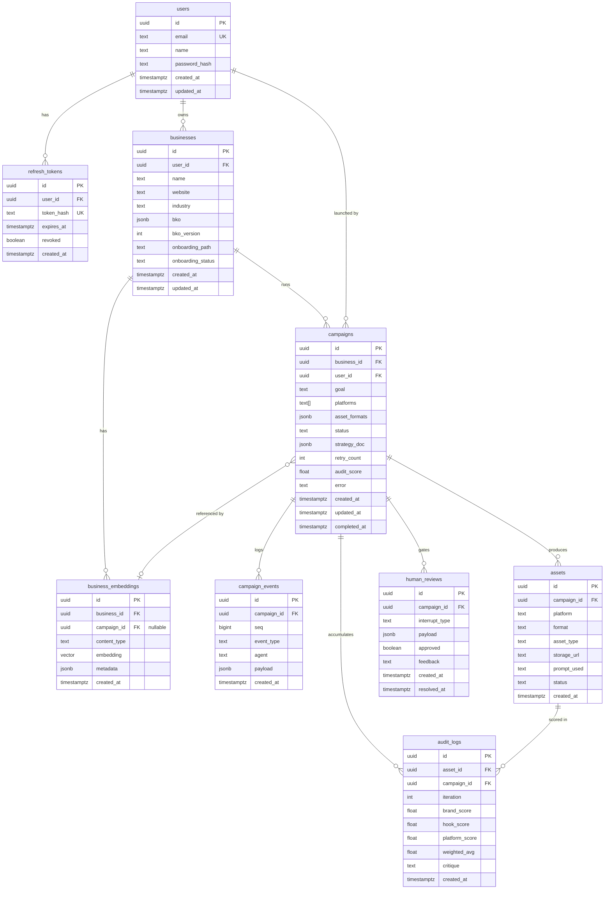

# AdGen-Agentic — Database Design

> PostgreSQL 16 + pgvector extension  
> Single database, single schema. All persistence lives here — state, events, vectors, auth, assets.

---

## Table of Contents

1. [Design Decisions](#1-design-decisions)
2. [Entity Overview](#2-entity-overview)
3. [ERD Diagram](#3-erd-diagram)
4. [Table Specifications](#4-table-specifications)
5. [Enums](#5-enums)
6. [Indexes](#6-indexes)
7. [Full DDL](#7-full-ddl)
8. [LangGraph Tables](#8-langgraph-tables)
9. [Migration Strategy](#9-migration-strategy)

---

## 1. Design Decisions

### Why these choices were made

**Single PostgreSQL instance for everything**  
No Redis, no Qdrant. PostgreSQL handles relational data, JSONB documents, vector embeddings (pgvector), real-time pub/sub (LISTEN/NOTIFY), and LangGraph checkpointing — all in one service. Fewer moving parts, one connection pool, one backup strategy.

**UUIDs as primary keys everywhere**  
UUIDs prevent enumeration attacks on API endpoints (`/campaigns/1`, `/campaigns/2` reveals count). `gen_random_uuid()` is built into PostgreSQL 13+, no extension needed.

**JSONB for flexible structured data**  
The BKO, strategy_doc, and event payloads evolve constantly during development. JSONB lets us change their internal shape without a migration. Stable, queryable fields (like `status`, `platform`, `score`) stay as typed columns.

**pgvector for past-campaign similarity**  
The Strategist agent retrieves past campaigns semantically similar to the current campaign goal. `vector(768)` matches the output dimension of Google's `text-embedding-004` model. IVFFlat index gives fast approximate nearest-neighbour search.

**Append-only campaign_events table**  
Every action an agent takes and every tool result that comes back is recorded here. This gives a full audit trail, supports debugging and replay, and feeds the WebSocket stream. Rows are never updated or deleted during a campaign run.

**Separate audit_logs from assets**  
An asset can be scored multiple times (retry loop). Each scoring pass is a separate row in `audit_logs` with an `iteration` counter. This preserves the full scoring history, not just the final score.

**Soft relationships on user_id in campaigns**  
Campaigns reference both `business_id` and `user_id`. `business_id` is the structural FK. `user_id` is denormalised for fast "show me all campaigns for this user" queries without a join through businesses.

---

## 2. Entity Overview

| Table | What it represents | Rows per user (approx) |
|---|---|---|
| `users` | A registered user account | 1 |
| `refresh_tokens` | Active JWT refresh tokens | 1–5 |
| `businesses` | A user's business profile + BKO | 1–10 |
| `business_embeddings` | pgvector rows for BKO + past campaign summaries | 1–50 per business |
| `campaigns` | A single ad campaign run | Many per business |
| `campaign_events` | Append-only event log per campaign | 50–200 per campaign |
| `assets` | A generated file (image / video / voice) per platform | 1–6 per campaign |
| `audit_logs` | Auditor scoring per asset per retry iteration | 1–3 per asset |
| `human_reviews` | Human-in-the-loop interrupt sessions | 0–2 per campaign |

---

## 3. ERD Diagram



---

## 4. Table Specifications

---

### `users`

The root entity. Every other table traces back here.

| Column | Type | Constraints | Notes |
|---|---|---|---|
| `id` | `uuid` | PK, default `gen_random_uuid()` | |
| `email` | `text` | NOT NULL, UNIQUE | Lowercased on insert |
| `name` | `text` | NOT NULL | Display name |
| `password_hash` | `text` | NOT NULL | bcrypt hash, never plain text |
| `created_at` | `timestamptz` | DEFAULT `now()` | |
| `updated_at` | `timestamptz` | DEFAULT `now()` | Updated via trigger |

---

### `refresh_tokens`

Tracks issued refresh tokens so they can be revoked individually (e.g. logout from one device).

| Column | Type | Constraints | Notes |
|---|---|---|---|
| `id` | `uuid` | PK | |
| `user_id` | `uuid` | FK → `users.id` ON DELETE CASCADE | |
| `token_hash` | `text` | NOT NULL, UNIQUE | SHA-256 of the raw token. Never store raw. |
| `expires_at` | `timestamptz` | NOT NULL | 7 days from issue |
| `revoked` | `boolean` | DEFAULT `false` | Set to `true` on logout |
| `created_at` | `timestamptz` | DEFAULT `now()` | |

---

### `businesses`

One row per business a user onboards. Contains the full Business Knowledge Object (BKO) as JSONB.

| Column | Type | Constraints | Notes |
|---|---|---|---|
| `id` | `uuid` | PK | |
| `user_id` | `uuid` | FK → `users.id` ON DELETE CASCADE | |
| `name` | `text` | NOT NULL | |
| `website` | `text` | | Nullable — not all onboarding paths have a URL |
| `industry` | `text` | | Top-level industry tag extracted from BKO |
| `bko` | `jsonb` | NOT NULL | Full Business Knowledge Object. Schema in ARCHITECTURE.md §5 |
| `bko_version` | `int` | DEFAULT `1` | Incremented on every BKO refresh |
| `onboarding_path` | `text` | NOT NULL | `url` \| `free_text` \| `form` |
| `onboarding_status` | `text` | DEFAULT `'pending'` | `pending` \| `complete` |
| `created_at` | `timestamptz` | DEFAULT `now()` | |
| `updated_at` | `timestamptz` | DEFAULT `now()` | |

**BKO querying**: Use `jsonb_path_query` or `->` / `->>` operators for targeted reads.  
Example — get the one-liner: `SELECT bko -> 'identity' ->> 'one_liner' FROM businesses WHERE id = $1`

---

### `business_embeddings`

pgvector rows for semantic similarity search. Two types of content are embedded:

- **`bko`**: The base business embedding created at onboarding. One per business.
- **`campaign_summary`**: A short summary of each completed campaign (goal + top hook + score). Written back after every successful campaign. Used by the Strategist to find relevant past campaigns.

| Column | Type | Constraints | Notes |
|---|---|---|---|
| `id` | `uuid` | PK | |
| `business_id` | `uuid` | FK → `businesses.id` ON DELETE CASCADE | |
| `campaign_id` | `uuid` | FK → `campaigns.id` ON DELETE SET NULL | Null for the base BKO embedding |
| `content_type` | `text` | NOT NULL | `bko` \| `campaign_summary` |
| `embedding` | `vector(768)` | NOT NULL | Google `text-embedding-004` output |
| `metadata` | `jsonb` | | Extra fields: goal, top_hook, score, platform — for filtering before similarity search |
| `created_at` | `timestamptz` | DEFAULT `now()` | |

**Query pattern** (find top 3 past campaigns similar to current goal):
```sql
SELECT metadata, 1 - (embedding <=> $goal_embedding) AS similarity
FROM business_embeddings
WHERE business_id = $business_id
  AND content_type = 'campaign_summary'
ORDER BY embedding <=> $goal_embedding
LIMIT 3;
```

---

### `campaigns`

One row per campaign run. Status transitions: `pending → running → awaiting_review → done | failed`

| Column | Type | Constraints | Notes |
|---|---|---|---|
| `id` | `uuid` | PK | Also used as LangGraph `thread_id` |
| `business_id` | `uuid` | FK → `businesses.id` ON DELETE CASCADE | |
| `user_id` | `uuid` | FK → `users.id` ON DELETE CASCADE | Denormalised for fast user-level queries |
| `goal` | `text` | NOT NULL | E.g. "Get free trial signups" |
| `platforms` | `text[]` | NOT NULL | E.g. `{linkedin,meta,tiktok}` |
| `asset_formats` | `jsonb` | | E.g. `{"linkedin": "1:1", "tiktok": "9:16"}` |
| `status` | `text` | DEFAULT `'pending'` | `pending \| running \| awaiting_review \| done \| failed` |
| `strategy_doc` | `jsonb` | | Populated after Strategist agent completes |
| `retry_count` | `int` | DEFAULT `0` | Number of Producer→Auditor retry cycles |
| `audit_score` | `float` | | Final weighted Auditor score |
| `error` | `text` | | Error message if `status = 'failed'` |
| `created_at` | `timestamptz` | DEFAULT `now()` | |
| `updated_at` | `timestamptz` | DEFAULT `now()` | |
| `completed_at` | `timestamptz` | | Set when status becomes `done` or `failed` |

> **Note**: `campaign.id` is passed directly as LangGraph's `thread_id` in the checkpointer config. This is the link between our DB and LangGraph's internal checkpoint tables.

---

### `campaign_events`

Append-only event log. Every agent action and tool result is written here. Never update or delete rows during a run. Used for:
- Real-time streaming via `pg_notify`
- Audit trail and debugging
- Replay if needed

| Column | Type | Constraints | Notes |
|---|---|---|---|
| `id` | `uuid` | PK | |
| `campaign_id` | `uuid` | FK → `campaigns.id` ON DELETE CASCADE | |
| `seq` | `bigint` | NOT NULL, generated always as identity | Monotonically increasing per campaign — guarantees ordering |
| `event_type` | `text` | NOT NULL | See event type enum below |
| `agent` | `text` | | `researcher \| strategist \| producer \| auditor \| system` |
| `payload` | `jsonb` | NOT NULL | Event-specific data |
| `created_at` | `timestamptz` | DEFAULT `now()` | |

**Event types**: `agent_start`, `tool_call`, `tool_result`, `agent_done`, `human_review_required`, `campaign_done`, `campaign_failed`

**Streaming pattern**: After inserting a row, the campaign runner calls:
```sql
SELECT pg_notify('campaign_' || campaign_id::text, row_to_json(new)::text);
```

---

### `assets`

One row per generated file. A campaign with 3 platforms produces 3+ asset rows.

| Column | Type | Constraints | Notes |
|---|---|---|---|
| `id` | `uuid` | PK | |
| `campaign_id` | `uuid` | FK → `campaigns.id` ON DELETE CASCADE | |
| `platform` | `text` | NOT NULL | `linkedin \| meta \| tiktok \| instagram \| ...` |
| `format` | `text` | NOT NULL | `1:1 \| 9:16 \| 16:9 \| 4:5` |
| `asset_type` | `text` | NOT NULL | `image \| video \| voice` |
| `storage_url` | `text` | NOT NULL | Cloudflare R2 public URL |
| `prompt_used` | `text` | | The generation prompt sent to Imagen 3 / Veo 3 |
| `status` | `text` | DEFAULT `'pending'` | `pending \| generating \| stored \| failed` |
| `created_at` | `timestamptz` | DEFAULT `now()` | |

---

### `audit_logs`

One row per asset per Auditor iteration. Preserves full scoring history across retry cycles.

| Column | Type | Constraints | Notes |
|---|---|---|---|
| `id` | `uuid` | PK | |
| `asset_id` | `uuid` | FK → `assets.id` ON DELETE CASCADE | |
| `campaign_id` | `uuid` | FK → `campaigns.id` ON DELETE CASCADE | Denormalised for fast campaign-level queries |
| `iteration` | `int` | NOT NULL | `0` = first pass, `1` = after first retry, etc. |
| `brand_score` | `float` | | 1–10. Visual / copy brand alignment |
| `hook_score` | `float` | | 1–10. First-frame / first-line attention capture |
| `platform_score` | `float` | | 1–10. Platform format and aesthetic fit |
| `weighted_avg` | `float` | | `0.4 × brand + 0.35 × hook + 0.25 × platform` |
| `critique` | `text` | | Actionable per-asset critique from Auditor agent |
| `created_at` | `timestamptz` | DEFAULT `now()` | |

---

### `human_reviews`

One row per interrupt. A campaign can have up to two (BKO gap-filling + asset approval). Stores what was shown to the user and what they decided.

| Column | Type | Constraints | Notes |
|---|---|---|---|
| `id` | `uuid` | PK | |
| `campaign_id` | `uuid` | FK → `campaigns.id` ON DELETE CASCADE | |
| `interrupt_type` | `text` | NOT NULL | `bko_gap \| asset_approval \| user_pause` |
| `payload` | `jsonb` | | What was sent to the frontend (assets, scores, gap fields) |
| `approved` | `boolean` | | `true` = approved / gap filled. `false` = rejected. Null = not yet resolved. |
| `feedback` | `text` | | User's rejection notes or gap-fill answers |
| `created_at` | `timestamptz` | DEFAULT `now()` | |
| `resolved_at` | `timestamptz` | | Set when `POST /campaigns/{id}/resume` is called |

---

## 5. Enums

These are implemented as `TEXT` columns with `CHECK` constraints rather than PostgreSQL `ENUM` types. Reason: adding a new value to a `ENUM` type requires a migration + lock; adding to a `CHECK` constraint is a simpler migration.

```sql
-- onboarding_path
CHECK (onboarding_path IN ('url', 'free_text', 'form'))

-- onboarding_status
CHECK (onboarding_status IN ('pending', 'complete'))

-- campaign status
CHECK (status IN ('pending', 'running', 'awaiting_review', 'done', 'failed'))

-- asset status
CHECK (status IN ('pending', 'generating', 'stored', 'failed'))

-- asset_type
CHECK (asset_type IN ('image', 'video', 'voice'))

-- interrupt_type
CHECK (interrupt_type IN ('bko_gap', 'asset_approval', 'user_pause'))

-- content_type (business_embeddings)
CHECK (content_type IN ('bko', 'campaign_summary'))

-- event_type (campaign_events)
CHECK (event_type IN (
    'agent_start', 'tool_call', 'tool_result', 'agent_done',
    'human_review_required', 'campaign_done', 'campaign_failed'
))

-- agent (campaign_events)
CHECK (agent IN ('researcher', 'strategist', 'producer', 'auditor', 'system'))
```

---

## 6. Indexes

### Access patterns driving index decisions

| Query | Table | Index |
|---|---|---|
| Login by email | `users` | UNIQUE on `email` |
| Validate refresh token | `refresh_tokens` | UNIQUE on `token_hash` |
| List businesses for a user | `businesses` | `(user_id)` |
| List campaigns for a user | `campaigns` | `(user_id)` |
| List campaigns for a business | `campaigns` | `(business_id)` |
| Find running campaigns (health check / retry) | `campaigns` | `(status)` |
| Load event log for a campaign in order | `campaign_events` | `(campaign_id, seq)` |
| List assets for a campaign | `assets` | `(campaign_id)` |
| Load audit history for an asset | `audit_logs` | `(asset_id)` |
| Load all audit rows for a campaign | `audit_logs` | `(campaign_id)` |
| Pending human review lookup | `human_reviews` | `(campaign_id)` |
| Semantic similarity search on embeddings | `business_embeddings` | IVFFlat on `embedding` |
| Filter embeddings by business + type | `business_embeddings` | `(business_id, content_type)` |

```sql
-- users
CREATE UNIQUE INDEX idx_users_email ON users(email);

-- refresh_tokens
CREATE INDEX idx_refresh_tokens_user   ON refresh_tokens(user_id);
CREATE UNIQUE INDEX idx_refresh_tokens_hash ON refresh_tokens(token_hash);

-- businesses
CREATE INDEX idx_businesses_user ON businesses(user_id);

-- business_embeddings
CREATE INDEX idx_embeddings_business_type ON business_embeddings(business_id, content_type);
-- IVFFlat: tune lists = sqrt(row count). Start with 10 for dev.
CREATE INDEX idx_embeddings_vector ON business_embeddings
    USING ivfflat (embedding vector_cosine_ops)
    WITH (lists = 10);

-- campaigns
CREATE INDEX idx_campaigns_business ON campaigns(business_id);
CREATE INDEX idx_campaigns_user     ON campaigns(user_id);
CREATE INDEX idx_campaigns_status   ON campaigns(status);

-- campaign_events
CREATE INDEX idx_events_campaign_seq ON campaign_events(campaign_id, seq);

-- assets
CREATE INDEX idx_assets_campaign ON assets(campaign_id);

-- audit_logs
CREATE INDEX idx_audit_asset    ON audit_logs(asset_id);
CREATE INDEX idx_audit_campaign ON audit_logs(campaign_id);

-- human_reviews
CREATE INDEX idx_reviews_campaign ON human_reviews(campaign_id);
```

---

## 7. Full DDL

Copy this exactly into the first Alembic migration.

```sql
-- ── Extensions ────────────────────────────────────────────────────────────────
CREATE EXTENSION IF NOT EXISTS "pgcrypto";   -- gen_random_uuid()
CREATE EXTENSION IF NOT EXISTS "vector";     -- pgvector

-- ── Updated-at trigger function ───────────────────────────────────────────────
CREATE OR REPLACE FUNCTION set_updated_at()
RETURNS TRIGGER AS $$
BEGIN
    NEW.updated_at = now();
    RETURN NEW;
END;
$$ LANGUAGE plpgsql;

-- ── users ─────────────────────────────────────────────────────────────────────
CREATE TABLE users (
    id            UUID        PRIMARY KEY DEFAULT gen_random_uuid(),
    email         TEXT        NOT NULL,
    name          TEXT        NOT NULL,
    password_hash TEXT        NOT NULL,
    created_at    TIMESTAMPTZ NOT NULL DEFAULT now(),
    updated_at    TIMESTAMPTZ NOT NULL DEFAULT now(),
    CONSTRAINT uq_users_email UNIQUE (email)
);

CREATE TRIGGER trg_users_updated_at
    BEFORE UPDATE ON users
    FOR EACH ROW EXECUTE FUNCTION set_updated_at();

-- ── refresh_tokens ────────────────────────────────────────────────────────────
CREATE TABLE refresh_tokens (
    id         UUID        PRIMARY KEY DEFAULT gen_random_uuid(),
    user_id    UUID        NOT NULL REFERENCES users(id) ON DELETE CASCADE,
    token_hash TEXT        NOT NULL,
    expires_at TIMESTAMPTZ NOT NULL,
    revoked    BOOLEAN     NOT NULL DEFAULT false,
    created_at TIMESTAMPTZ NOT NULL DEFAULT now(),
    CONSTRAINT uq_refresh_tokens_hash UNIQUE (token_hash)
);

CREATE INDEX idx_refresh_tokens_user ON refresh_tokens(user_id);

-- ── businesses ────────────────────────────────────────────────────────────────
CREATE TABLE businesses (
    id                UUID        PRIMARY KEY DEFAULT gen_random_uuid(),
    user_id           UUID        NOT NULL REFERENCES users(id) ON DELETE CASCADE,
    name              TEXT        NOT NULL,
    website           TEXT,
    industry          TEXT,
    bko               JSONB       NOT NULL DEFAULT '{}',
    bko_version       INT         NOT NULL DEFAULT 1,
    onboarding_path   TEXT        NOT NULL
                          CONSTRAINT chk_businesses_onboarding_path
                          CHECK (onboarding_path IN ('url', 'free_text', 'form')),
    onboarding_status TEXT        NOT NULL DEFAULT 'pending'
                          CONSTRAINT chk_businesses_onboarding_status
                          CHECK (onboarding_status IN ('pending', 'complete')),
    created_at        TIMESTAMPTZ NOT NULL DEFAULT now(),
    updated_at        TIMESTAMPTZ NOT NULL DEFAULT now()
);

CREATE INDEX idx_businesses_user ON businesses(user_id);

CREATE TRIGGER trg_businesses_updated_at
    BEFORE UPDATE ON businesses
    FOR EACH ROW EXECUTE FUNCTION set_updated_at();

-- ── business_embeddings ───────────────────────────────────────────────────────
CREATE TABLE business_embeddings (
    id           UUID        PRIMARY KEY DEFAULT gen_random_uuid(),
    business_id  UUID        NOT NULL REFERENCES businesses(id) ON DELETE CASCADE,
    campaign_id  UUID,                          -- FK added after campaigns table exists
    content_type TEXT        NOT NULL
                     CONSTRAINT chk_embeddings_content_type
                     CHECK (content_type IN ('bko', 'campaign_summary')),
    embedding    VECTOR(768) NOT NULL,
    metadata     JSONB       NOT NULL DEFAULT '{}',
    created_at   TIMESTAMPTZ NOT NULL DEFAULT now()
);

CREATE INDEX idx_embeddings_business_type ON business_embeddings(business_id, content_type);
CREATE INDEX idx_embeddings_vector ON business_embeddings
    USING ivfflat (embedding vector_cosine_ops)
    WITH (lists = 10);

-- ── campaigns ─────────────────────────────────────────────────────────────────
CREATE TABLE campaigns (
    id            UUID        PRIMARY KEY DEFAULT gen_random_uuid(),
    business_id   UUID        NOT NULL REFERENCES businesses(id) ON DELETE CASCADE,
    user_id       UUID        NOT NULL REFERENCES users(id) ON DELETE CASCADE,
    goal          TEXT        NOT NULL,
    platforms     TEXT[]      NOT NULL,
    asset_formats JSONB       NOT NULL DEFAULT '{}',
    status        TEXT        NOT NULL DEFAULT 'pending'
                      CONSTRAINT chk_campaigns_status
                      CHECK (status IN ('pending', 'running', 'awaiting_review', 'done', 'failed')),
    strategy_doc  JSONB,
    retry_count   INT         NOT NULL DEFAULT 0,
    audit_score   FLOAT,
    error         TEXT,
    created_at    TIMESTAMPTZ NOT NULL DEFAULT now(),
    updated_at    TIMESTAMPTZ NOT NULL DEFAULT now(),
    completed_at  TIMESTAMPTZ
);

CREATE INDEX idx_campaigns_business ON campaigns(business_id);
CREATE INDEX idx_campaigns_user     ON campaigns(user_id);
CREATE INDEX idx_campaigns_status   ON campaigns(status);

CREATE TRIGGER trg_campaigns_updated_at
    BEFORE UPDATE ON campaigns
    FOR EACH ROW EXECUTE FUNCTION set_updated_at();

-- Add deferred FK from business_embeddings to campaigns
ALTER TABLE business_embeddings
    ADD CONSTRAINT fk_embeddings_campaign
    FOREIGN KEY (campaign_id) REFERENCES campaigns(id) ON DELETE SET NULL;

-- ── campaign_events ───────────────────────────────────────────────────────────
CREATE TABLE campaign_events (
    id          UUID        PRIMARY KEY DEFAULT gen_random_uuid(),
    campaign_id UUID        NOT NULL REFERENCES campaigns(id) ON DELETE CASCADE,
    seq         BIGINT      NOT NULL GENERATED ALWAYS AS IDENTITY,
    event_type  TEXT        NOT NULL
                    CONSTRAINT chk_events_event_type
                    CHECK (event_type IN (
                        'agent_start', 'tool_call', 'tool_result', 'agent_done',
                        'human_review_required', 'campaign_done', 'campaign_failed'
                    )),
    agent       TEXT
                    CONSTRAINT chk_events_agent
                    CHECK (agent IN ('researcher', 'strategist', 'producer', 'auditor', 'system')),
    payload     JSONB       NOT NULL DEFAULT '{}',
    created_at  TIMESTAMPTZ NOT NULL DEFAULT now()
);

CREATE INDEX idx_events_campaign_seq ON campaign_events(campaign_id, seq);

-- ── assets ────────────────────────────────────────────────────────────────────
CREATE TABLE assets (
    id          UUID        PRIMARY KEY DEFAULT gen_random_uuid(),
    campaign_id UUID        NOT NULL REFERENCES campaigns(id) ON DELETE CASCADE,
    platform    TEXT        NOT NULL,
    format      TEXT        NOT NULL,
    asset_type  TEXT        NOT NULL
                    CONSTRAINT chk_assets_type
                    CHECK (asset_type IN ('image', 'video', 'voice')),
    storage_url TEXT        NOT NULL,
    prompt_used TEXT,
    status      TEXT        NOT NULL DEFAULT 'pending'
                    CONSTRAINT chk_assets_status
                    CHECK (status IN ('pending', 'generating', 'stored', 'failed')),
    created_at  TIMESTAMPTZ NOT NULL DEFAULT now()
);

CREATE INDEX idx_assets_campaign ON assets(campaign_id);

-- ── audit_logs ────────────────────────────────────────────────────────────────
CREATE TABLE audit_logs (
    id             UUID        PRIMARY KEY DEFAULT gen_random_uuid(),
    asset_id       UUID        NOT NULL REFERENCES assets(id) ON DELETE CASCADE,
    campaign_id    UUID        NOT NULL REFERENCES campaigns(id) ON DELETE CASCADE,
    iteration      INT         NOT NULL DEFAULT 0,
    brand_score    FLOAT,
    hook_score     FLOAT,
    platform_score FLOAT,
    weighted_avg   FLOAT,
    critique       TEXT,
    created_at     TIMESTAMPTZ NOT NULL DEFAULT now()
);

CREATE INDEX idx_audit_asset    ON audit_logs(asset_id);
CREATE INDEX idx_audit_campaign ON audit_logs(campaign_id);

-- ── human_reviews ─────────────────────────────────────────────────────────────
CREATE TABLE human_reviews (
    id             UUID        PRIMARY KEY DEFAULT gen_random_uuid(),
    campaign_id    UUID        NOT NULL REFERENCES campaigns(id) ON DELETE CASCADE,
    interrupt_type TEXT        NOT NULL
                       CONSTRAINT chk_reviews_interrupt_type
                       CHECK (interrupt_type IN ('bko_gap', 'asset_approval', 'user_pause')),
    payload        JSONB       NOT NULL DEFAULT '{}',
    approved       BOOLEAN,
    feedback       TEXT,
    created_at     TIMESTAMPTZ NOT NULL DEFAULT now(),
    resolved_at    TIMESTAMPTZ
);

CREATE INDEX idx_reviews_campaign ON human_reviews(campaign_id);
```

---

## 8. LangGraph Tables

LangGraph's `AsyncPostgresSaver` auto-creates three tables when the checkpointer is first initialised. **Do not create these manually.** They are managed entirely by LangGraph.

| Table | Purpose |
|---|---|
| `checkpoints` | One row per completed graph node. Stores serialised LangGraph state. Keyed by `thread_id` (= our `campaign.id`) + `checkpoint_id`. |
| `checkpoint_blobs` | Large blob storage for checkpoint state values that exceed inline size. |
| `checkpoint_writes` | Pending writes buffered before a checkpoint is committed. |

**The link between our schema and LangGraph:**  
`campaigns.id` is passed as `thread_id` in every `graph.ainvoke()` call:

```python
await graph.ainvoke(
    state,
    config={"configurable": {"thread_id": str(campaign.id)}}
)
```

This means you can always look up the full LangGraph checkpoint state for any campaign using its UUID.

**On crash recovery**: LangGraph reads its own `checkpoints` table to find the last completed node, then resumes from there using the serialised state. Our `campaign_events` table is independent and records what actually happened — it's the human-readable audit trail.

---

## 9. Migration Strategy

### Tooling
Alembic with async SQLAlchemy. One migration file per logical change.

### File: `alembic.ini` (key setting)
```ini
sqlalchemy.url = postgresql+asyncpg://%(DB_USER)s:%(DB_PASSWORD)s@%(DB_HOST)s/%(DB_NAME)s
```

### Migration order
```
0001_create_extensions_and_users.py
0002_create_refresh_tokens.py
0003_create_businesses.py
0004_create_business_embeddings.py
0005_create_campaigns_and_fk_patch.py
0006_create_campaign_events.py
0007_create_assets.py
0008_create_audit_logs.py
0009_create_human_reviews.py
```

`business_embeddings.campaign_id` FK is added in `0005` after `campaigns` exists — this is why it uses `ALTER TABLE` rather than being inline.

### Commands

```bash
# create a new migration (from inside adgen/)
alembic revision --autogenerate -m "description"

# apply all pending migrations
alembic upgrade head

# roll back one migration
alembic downgrade -1

# check current revision
alembic current
```

### Rules
- **Never edit a migration that has been applied to any environment.** Create a new one.
- **Always run `alembic upgrade head` in docker-compose startup** so the dev DB is always in sync.
- When changing the BKO schema shape, update the `bko` JSONB default and document the new shape in `schemas/bko.py` — no migration needed for JSONB internals.
- When changing `vector(768)` dimension (e.g. switching embedding model), you must drop and recreate the `embedding` column and re-index. Plan for a re-embedding job.
