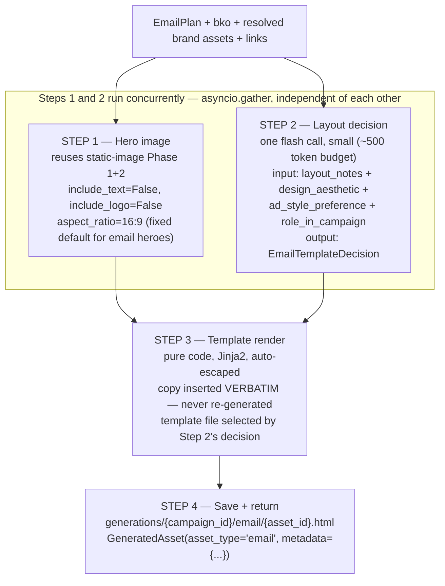

# Email Template Agent — Full Architecture

> **Status:** Design — not yet implemented. Second of the three Producer sub-agents (after
> [static image](STATIC_AD_AGENT.md), which is built and verified end-to-end). video_ad remains
> unbuilt (no video/voice generation provider exists — see
> [BUILDER_AGENT_DATA_AUDIT.md](BUILDER_AGENT_DATA_AUDIT.md) §4).
> **Model:** `gemini-2.5-flash` (kie.ai) for one layout decision call; reuses the static-image
> sub-agent's `nano-banana-pro` call for the hero image. No LLM call ever touches the copy itself.

---

## 1. Where it sits in the pipeline

Same integration point as the static-image sub-agent — `ProducerPipeline` (`agents/producer/graph.py`)
routes `strategy_doc.asset_plan` entries by `asset_type`; `"email"` entries route here instead of being
omitted.

```
run_strategist → hitl_plan_approval (extended — see §6) → run_producer
                                                                  │
                                              ┌───────────────────┴───────────────────┐
                                              ▼                                       ▼
                                  static_image sub-agent                    email_template sub-agent (this doc)
                                                                                       │
                                                                        {"generated_assets": [GeneratedAsset, ...]}
                                                                                       │
                                                                                       ▼
                                                    orchestrator/nodes.py::run_producer persists via
                                                    campaign_repo.create_asset()  →  assets table
```

---

## 2. What changed from the first draft, and why

The first pass at this design called the whole rendering stage "pure code." That was wrong in one
specific, important way, corrected here:

| Claim | Verdict | Reasoning |
|---|---|---|
| Copy insertion (subject/body/CTA text) is pure code | **Correct, kept** | `EmailPlan`'s copy is already publication-ready — re-running it through an LLM risks the exact failure `STRATEGIST_AGENT_V2.md` was built to eliminate: *"Never let the LLM transcribe its own tool outputs... the agent paraphrases/compresses tool output while assembling the final JSON."* |
| Layout/visual treatment is pure code | **Wrong, revised** | A luxury brand and a scrappy D2C brand shouldn't render identically. `EmailPlan.layout_notes` (freeform prose the Strategist already writes per-asset) and `bko.brand.visual_identity.design_aesthetic` (a real enum) were being computed upstream and then discarded. This is now a real decision step — §4. |
| Only `cta_url` matters for links | **Wrong, revised** | A usable email needs a website link, social links, and sometimes secondary in-body links — none of which `EmailPlan` carries today. Resolved in §6, distinguishing business-level links (belong on the BKO) from campaign-specific ones (belong at HITL). |

---

## 3. Full input set

| Source | Fields | Used for |
|---|---|---|
| `EmailPlan` (this asset) | `subject_line`, `preview_text`, `headline`, `body_paragraphs[]`, `cta_text`, `cta_url`, `hero_image_brief`, `layout_notes`, `disclosures[]`, `hero_product`, `role_in_campaign`, `funnel_stage`, `compliance_notes` | Copy content, layout signal, compliance footer |
| `bko.identity` | `company_name`, `website`, `logo_url` | Header branding, footer website link |
| `bko.brand.visual_identity` | `primary_colors`, `secondary_colors`, `font_style`, `design_aesthetic`, `imagery_style` | Layout decision, hero image brand grounding |
| `bko.marketing_context.ad_style_preference` | — | Layout decision |
| `resolve_brand_assets(bko, hero_product, product_image_override=...)` | `logo_url`, `product_image_url`, `gaps[]` | Hero image grounding (product only — never the logo, see §5) |
| Campaign-level | `special_brief`, `tone_override` | Minor tone context for the layout decision |
| **New**: business-level social links (BKO extension, see §6.1) | `social_links: dict[str, str]` | Footer social icons |
| **New**: campaign-level secondary links (HITL, see §6.2) | `secondary_links: dict[str, str]` | Optional in-body links beyond the primary CTA |

---

## 4. Processing — four steps, two of them run concurrently



### Step 1 — Hero image

Calls the exact same `plan_static_image()`/`generate_static_image()` functions the static-image
sub-agent uses (`agents/producer/skills.py`), parameterized:

- `include_text=False` — `hero_image_brief` is explicitly a text-free scene brief; the HTML carries all
  copy, nothing gets baked into the image.
- `include_logo=False` — the logo is a header element in the HTML (Step 3), never merged into the photo.
  This is the deliberate resolution to the "logo not modeled in `EmailPlan`" gap noted in
  [BUILDER_AGENT_DATA_AUDIT.md](BUILDER_AGENT_DATA_AUDIT.md) §5 — it was never a missing-data problem
  (`resolve_brand_assets()` already returns the logo regardless of what `EmailPlan` models), only a
  placement decision.
- `aspect_ratio="16:9"` — fixed default; `EmailPlan` has no per-asset aspect ratio field the way
  `StaticImagePlan`/`VideoAdPlan` do (their `format` comes from real platform ad specs; email doesn't
  have an equivalent), so this is a deliberate, documented choice rather than an inherited one.

Requires extracting the static-image playbook's prompt-writing logic (`agents/producer/prompts.py`) to
take `include_text`/`include_logo` flags instead of hardcoding both `True`, per the plan already agreed
in the prior architecture discussion — a small, contained refactor of code that already exists and is
tested, not new generation logic.

### Step 2 — Layout decision

One structured `gemini-2.5-flash` call (same calling convention as every other Producer/Strategist LLM
call in this codebase — plain `.ainvoke()`, hand-parsed JSON, one repair turn — never
`.with_structured_output()`, for the kie.ai proxy-quirk reasons already established in
`utils/LLM/providers/kie.py`). Small and cheap: it never sees the copy itself, only style signals.

**Output — `EmailTemplateDecision`:**

```python
class EmailTemplateDecision(BaseModel):
    template_name: Literal["hero_banner", "minimal_text_forward", "story_long_form", "product_split"]
    hero_treatment: Literal["full_width_banner", "inset_padded"]
    button_style: Literal["solid_rounded", "solid_square", "outline"]
    accent_usage: str    # short narrative note on applying brand color within the template's fixed slots
    reasoning: str
```

`template_name` selects from a **small, fixed library** of hand-built HTML templates (§5) — this is not
free-form LLM-authored markup. Same principle as the static-image agent's bounded reference-image
handling: a bounded creative decision space, not full generative freedom, because broken/inconsistent
HTML across email clients is a real, not theoretical, risk.

### Step 3 — Template render

Pure code, Jinja2 (auto-escaping — `body_paragraphs`/`headline` are LLM-generated text and must never be
inserted unescaped). Loads the template file named by `EmailTemplateDecision.template_name`, fills:

- Header: `logo_url`, `company_name`
- Hero: the Step 1 image, treated per `hero_treatment`
- `headline`, `body_paragraphs[]` (looped, verbatim), `cta_text`/`cta_url` (rendered twice, per the
  Strategist's own `EMAIL_PLAYBOOK` — already enforced upstream, the template just needs two CTA slots)
- Footer: `disclosures[]`, website link, social links (if present), secondary links (if present),
  unsubscribe placeholder (static compliance boilerplate — see §6.3)
- `preview_text` → the standard hidden preheader `<div style="display:none">` trick
- Button/accent styling per `button_style`/`accent_usage`

### Step 4 — Save and return

```python
GeneratedAsset(
    asset_id=..., asset_type="email", platform="email", format="email",
    storage_url="generations/{campaign_id}/email/{asset_id}.html",
    prompt_used=<Step 1's hero image prompt>,   # audit trail, same convention as static image
    metadata={
        "subject_line": email_plan.subject_line,
        "preview_text": email_plan.preview_text,
        "sender_name": bko.identity.company_name,
        "template_used": decision.template_name,
    },
    status="stored",
)
```

`metadata` is a **new field on the existing `GeneratedAsset` schema** (`agents/producer/schemas.py`) —
`dict = Field(default_factory=dict)`, empty for image assets, populated for email. This is what closes
the frontend gap identified earlier: without it, the frontend has no reliable way to get
`subject_line`/`preview_text` for the inbox-style header, since `run_producer` overwrites the strategy's
own `asset_id` with the DB UUID during persistence, breaking any join back to `strategy_doc.asset_plan[]`.

---

## 5. The template library

Four hand-built HTML files (table-based layout, inline CSS — the traditional email-client-safe pattern;
no MJML/Node tooling, consistent with this project's minimal-infra philosophy elsewhere):

| Template | Suits | Structure |
|---|---|---|
| `hero_banner` | `bold_vibrant`, `playful` | Full-width hero image top, headline overlaid or immediately below, single CTA-forward layout |
| `minimal_text_forward` | `clean_minimal`, `corporate` | Small inset hero (or none), generous whitespace, text-led |
| `story_long_form` | `warm_earthy`, narrative brand voices | Larger hero, longer paragraph spacing, editorial feel — matches brands like the Karakoram Kitchen fixture used in the static-image test |
| `product_split` | `luxury`, `dark_tech` | Hero image and headline side-by-side (stacks on mobile), product-forward |

Each is a real `.html` file with Jinja2 `{{ }}` slots, not a runtime-generated structure — adding a
template variant later means adding a file + a `Literal` value, not touching the decision or render code.

---

## 6. Links — resolved per source, not all via HITL

The original suggestion was "collect links via HITL." Splitting by whether the data is business-level
(static, doesn't change per campaign) or campaign-level (genuinely one-off) gives a better answer than
re-asking for static business data on every campaign:

### 6.1 Business-level (belongs on the BKO, not runtime HITL)

`website` already exists (`bko.identity.website`) — free today, zero new work. **Social links do not
exist anywhere in the BKO schema** (`bko.marketing_context.active_platforms` is platform *names* —
`["Instagram", "WhatsApp Business"]` — never actual profile URLs). Fixing this properly means adding a
`social_links: dict[str, str]` field to the BKO onboarding form (`schemas/business.py`'s
`MarketingFormSection` or a new field on `CompanyFormSection`) — **out of scope for this agent**, but
worth flagging now rather than papering over it with a per-campaign HITL prompt for data that's really a
one-time business fact.

### 6.2 Campaign-level (genuinely belongs at HITL)

A secondary in-body link specific to this campaign (e.g. "see the full Eid collection" pointing at a
campaign landing page) is real per-campaign data nobody can invent. Extends `hitl_plan_approval`'s
review payload the same way `product_overrides` did for the static-image agent: an optional
`secondary_links: dict[str, str]` (asset_id → {label: url}) the reviewer can fill in before approving,
carried through `CampaignState` the same way `product_overrides` already is
(`orchestrator/state.py`).

### 6.3 Template-level (needs no input at all)

Unsubscribe is standard compliance boilerplate, not campaign data — a static placeholder in every
template. It stays inert (no real unsubscribe endpoint) until actual email-sending infrastructure exists,
which it doesn't yet (no SMTP/ESP integration anywhere in this codebase) — this agent produces an HTML
**artifact**, not a sent email.

---

## 7. Required changes to existing code

| File | Change |
|---|---|
| `agents/producer/schemas.py` | Add `metadata: dict = Field(default_factory=dict)` to `GeneratedAsset` |
| `agents/producer/prompts.py` | Parameterize `STATIC_IMAGE_PLAYBOOK`/`build_static_image_input` with `include_text`/`include_logo` flags |
| `agents/producer/skills.py` | Add `plan_email_layout()` (Step 2), `render_email_template()` (Step 3) |
| `agents/producer/templates/*.html` | New — the 4 Jinja2 template files (§5) |
| `agents/producer/graph.py` | `ProducerPipeline.SUPPORTED_TYPES` gains `"email"`; routes to the email skill |
| `orchestrator/state.py` | Add `secondary_links: dict[str, dict[str, str]] | None` alongside the existing `product_overrides` |
| `orchestrator/nodes.py::hitl_plan_approval` | Surface `secondary_links` in the resume payload, same pattern as `product_overrides` |
| `schemas/business.py` | (Separate, smaller piece of work) add `social_links` to BKO onboarding — §6.1 |
| **DB migration** | `assets.metadata JSONB DEFAULT '{}'` — new Alembic revision |
| `sql/campaign/*.sql` | `sp_create_asset` gains a `metadata` param |
| `repos/campaign_repo.py::create_asset` | Pass `metadata` through |
| `schemas/campaign.py::AssetResponse` | Add `metadata: dict` |
| `frontend/.../asset-gallery.tsx` | `AssetModal` renders `<iframe src={toAssetUrl(asset.storage_url)}>` for `asset_type=="email"`, uses `asset.metadata.subject_line`/`.preview_text`/`.sender_name` for the inbox-style header chrome, desktop/mobile viewport toggle |

---

## 8. Known gaps / explicitly out of scope

| Gap | Why deferred |
|---|---|
| Actual email sending (SMTP/ESP) | No such infrastructure exists anywhere in this codebase; this agent's deliverable is an HTML artifact |
| Real unsubscribe mechanism | Depends on the above |
| Social links on the BKO | Separate onboarding-schema piece of work, noted in §6.1, not blocking this agent (templates just omit the social row when absent) |
| Dark-mode email rendering | Email client dark-mode handling is notoriously inconsistent; not addressed in v1 templates |
| PNG snapshot preview (vs. live iframe) | Iframe rendering is sufficient and cheaper; a headless-browser screenshot service is a possible future addition, not needed now |
| More than 4 template variants | Library grows by adding a file + enum value; not a redesign |

---

## 9. Verification

Same cheapest-first approach as the static-image agent:

1. Offline: call the Jinja2 render step directly with a hand-built `EmailPlan` + fake hero image path —
   no LLM/network cost, confirms the template fills correctly and escapes copy properly.
2. One real `plan_email_layout()` call — inspect the returned `EmailTemplateDecision` against the BKO's
   `design_aesthetic` by eye before spending a real hero-image generation call.
3. Full email skill end-to-end against the same Karakoram Kitchen fixture already used for the
   static-image test (business/products/logo already exist in the DB from that run) — confirm the `.html`
   lands at the right path and opens correctly in a browser.
4. Through `ProducerPipeline.ainvoke()` with a mixed `static_image` + `email` `strategy_doc`, confirming
   both sub-agents run correctly in the same batch.
5. One real campaign through the full orchestrator, confirming the `assets.metadata` column persists and
   `GET /campaigns/{id}/assets` returns it correctly.
