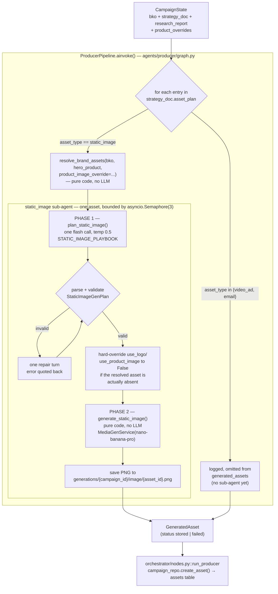

# Static Ad Agent — Design & Architecture

> **Status:** Built (`agents/producer/`) — first of the three Producer sub-agents (video_ad and email are
> not implemented yet; see [BUILDER_AGENT_DATA_AUDIT.md](BUILDER_AGENT_DATA_AUDIT.md) for the full gap
> analysis behind that decision).
> **Model:** `gemini-2.5-flash` (kie.ai) for the one creative-planning call; `nano-banana-pro` (kie.ai) for
> image generation.
> **Supersedes:** the "Producer" section of [BUILDER_AGENT_DATA_AUDIT.md](BUILDER_AGENT_DATA_AUDIT.md) for
> the static-image case specifically — that doc's gap table (no `resolve_brand_assets()`, `MediaGen`
> "broken") predates this build; both are now real.

---

## 1. Where it sits in the pipeline

```
load_bko → run_researcher → hitl_research_review → run_strategist → hitl_plan_approval
                                                                            │
                                                                            ▼
                                                                     run_producer
                                                                            │
                                                          ┌─────────────────┴─────────────────┐
                                                          ▼                                   ▼
                                              ProducerPipeline.ainvoke(state)          (video_ad, email —
                                              routes strategy_doc.asset_plan            not built yet;
                                              entries by asset_type                     entries logged
                                                          │                             and omitted)
                                        ┌─────────────────┘
                                        ▼
                          static_image sub-agent (this doc)
                          Phase 1 (creative plan) → Phase 2 (generate)
                                        │
                                        ▼
                          {"generated_assets": [GeneratedAsset, ...]}
                                        │
                                        ▼
                    orchestrator/nodes.py::run_producer persists each
                    via campaign_repo.create_asset()  →  assets table
```

`orchestrator/nodes.py::run_producer` ([orchestrator/nodes.py:365](../../orchestrator/nodes.py#L365)) is
the only integration point — it calls `producer_agent.ainvoke(dict(state))` and persists whatever comes
back in `generated_assets`. This call site required **zero shape changes** to add real generation behind
it: the same pattern that let the Strategist go from a monolithic agent to a 3-stage pipeline without
touching `orchestrator/graph.py` applies here too — the orchestrator only knows about the
`{"generated_assets": [...]}` contract, never how the Producer is internally built.

Two small bugs in `run_producer` were fixed as part of this build (it previously hardcoded
`asset_type="ad_copy"`, not a legal value under the `assets.asset_type` CHECK constraint
`image|video|voice|email`, and read a nonexistent `visual_description` key) — see §7.

---

## 2. Design principles (why it looks like this)

| Principle | Consequence |
|---|---|
| **Not a ReAct agent.** Generating one static ad is a mostly-deterministic sequence with exactly one point of real creative judgment. A tool-calling loop adds latency, cost, and unpredictability exactly where none is needed — same reasoning that moved the Strategist off a monolithic agent. | The whole sub-agent is a plain two-phase pipeline: one structured LLM call, then pure code. |
| **The Strategist's `image_prompt` is a draft, not a deliverable.** `StaticImagePlan.image_prompt` is marketing creative direction, written by a copywriter persona with no knowledge of nano-banana's prompting requirements. | Phase 1 writes an entirely new, production-grade prompt — it may draw on `image_prompt` for the creative idea but never quotes it verbatim into the final prompt. |
| **Nano Banana is a reasoning model, not a keyword matcher.** Confirmed via `examples/nano_banana_propmt.yaml`'s rubric (written for a different domain — identity-preserving hairstyle transformation — but its structural rules generalize directly). | The final prompt is always a narrative director's brief in a fixed part order, never a tag list or Seedream-style parameter string — see §4. |
| **Positive framing only.** The same rubric is explicit that Nano Banana responds far better to "preserve X" than "don't change X" — negative framing measurably degrades identity/fidelity preservation. | Every instruction in the playbook (`agents/producer/prompts.py::STATIC_IMAGE_PLAYBOOK`) is phrased as what to render, never what to avoid. |
| **Never let the LLM decide file paths.** Which real logo/product image exists is a deterministic lookup (`resolve_brand_assets()`), not a creative call. | Phase 1 only receives *availability* (booleans + product name) and decides *whether* to use what's available; Phase 2 resolves the actual paths in pure code, and hard-overrides the LLM's decision to `False` if the resolved asset doesn't actually exist. |
| **One failed asset must never cost the whole batch.** Media generation is slow (nano-banana polls for up to ~6 minutes, see `_kie_ai_base.py::MAX_POLL_ATTEMPTS`) and not free. | Every asset's Phase 1 + Phase 2 is wrapped in its own try/except inside `ProducerPipeline`; a failure becomes a `GeneratedAsset(status="failed")` record, never a raised exception that would make LangGraph's node-level `RetryPolicy` re-run every asset in the batch. |

---

## 3. Architecture overview



---

## 4. Phase 1 — creative planning (`agents/producer/skills.py::plan_static_image`)

One `gemini-2.5-flash` call via `get_llm_model(LLMConfig(provider="kie", ...))`, calling `.ainvoke()`
directly and hand-parsing JSON (`agents.strategist.validation.parse_json_object` + `model_validate`, one
repair turn on failure) — **not** `.with_structured_output()`. This matches the Strategist's own skills
exactly, for the same reason: kie.ai's proxy has quirks around tool-call-style structured output
(null-content assistant messages, literal `&` characters — see `utils/LLM/providers/kie.py`).

### What it decides

| Decision | How |
|---|---|
| `use_avatar` / `avatar_description` | Judged from `bko.marketing_context.ad_style_preference`, the target persona's demographics, and the product type — there is no reference photo for an avatar, so if one is used it's entirely the model's invention, grounded only for plausibility. |
| `use_logo`, `use_product_image` | Creative judgment layered on top of raw availability — the prompt tells the model which references genuinely exist (`brand_assets_available` in the user prompt), and code hard-forces both to `False` afterward if `resolve_brand_assets()` didn't actually resolve them. A gap can never be silently overridden by the LLM assuming a reference exists. |
| `final_prompt` | The production-grade nano-banana prompt — see the 8-part structure below. |

### The 8-part prompt structure (`STATIC_IMAGE_PLAYBOOK`, `agents/producer/prompts.py`)

Directly generalized from `examples/nano_banana_propmt.yaml`'s rubric (a hairstyle-transformation
prompt-engineering spec for the same model family) — its structural requirements transfer to any
nano-banana generation task:

1. **Context frame** — one sentence stating the ad's purpose/platform.
2. **Subject descriptor** — names the real product so the text corroborates the reference image passed
   alongside it (rather than reconstructing the product from scratch).
3. **Fidelity preservation** (positive framing mandatory) — the ad-generation analogue of the rubric's
   "identity preservation" block, aimed at product packaging/label and logo proportions/colors instead of
   a person's face.
4. **Scene & composition** — setting, lighting, camera angle, the avatar decision (if any), aspect ratio.
5. **Brand visual identity** — `bko.brand.visual_identity` translated into narrative language, never a
   raw hex/field dump.
6. **Minimal on-image text** — the one deliberate override from the Strategist's original schema (see
   §6): headline/CTA are baked into the image, but the instruction explicitly demands brevity — a short
   phrase and button-style CTA label, never the full `body_copy`.
7. **Photorealism/quality**, positively framed — professional ad-photography context preferred over raw
   EXIF-style parameters, matching the rubric's own rule.
8. **Closing positive preservation confirmation** — asserts product/logo/brand-color fidelity holds
   throughout, mirroring the rubric's mandatory closing sentence.

Cross-cutting rules carried over verbatim from the rubric: `final_prompt` is a single continuous string
(no bullets/newlines/markdown), fully self-contained (no pipeline-internal references), never inventing a
brand element not present in the BKO.

### What reaches Phase 1 (`build_static_image_input`, `agents/producer/prompts.py`)

| Source | Fields |
|---|---|
| This asset (`StaticImagePlan`) | platform, format, role_in_campaign, angle, hero_product, target_emotion, key_message, copy_tone, hook, headline, cta, draft `image_prompt`, `text_overlay`, `visual_avoid`, `compliance_notes` |
| `strategy_doc` (document-level) | campaign_theme, target_emotion, what_to_avoid |
| Campaign brief | special_brief, tone_override |
| `bko.identity` | description, business_type |
| `bko.brand.visual_identity` | primary_colors, secondary_colors, font_style, imagery_style, design_aesthetic, visual_do, visual_dont |
| `bko.marketing_context.ad_style_preference` | — |
| `bko.audience.primary` | persona_name, demographics (avatar plausibility only) |
| Resolved brand assets | availability booleans + resolved product name — **never raw file paths** |
| `research_report.platform_insights[]` (matching platform) | dos, donts, content_themes — tolerates absence (known Researcher gap) |
| `research_report.asset_type_insights.static_image` | best_practices, visual_patterns, cta_patterns — tolerates absence |

---

## 5. Phase 2 — generation (`agents/producer/skills.py::generate_static_image`)

Pure code, no LLM call, never raises (a failure becomes `GeneratedAsset(status="failed", error=...)`):

1. `image_path` = `brand_assets.product_image_url` if `plan.use_product_image` else `None`.
2. `reference_image_path` = `brand_assets.logo_url` if `plan.use_logo` else `None`.
3. `output_path` = `utils.storage.asset_output_path(campaign_id, asset_id, "image")` — new helper added
   alongside the existing `save_asset()`/`save_generation()` conventions; computes
   `generations/{campaign_id}/image/{asset_id}.png` without writing (the MediaGen provider writes there).
4. `MediaGenService(MediaGenConfig(provider="nano-banana", model_name="nano-banana-pro")).generate(ImageRequest(prompt=plan.final_prompt, image_path=..., reference_image_path=..., aspect_ratio=asset["format"], output_path=...))`.
5. On success → `GeneratedAsset(status="stored", storage_url=output_path, prompt_used=plan.final_prompt)`.

**Reference-image scope for this pass:** `nano-banana-pro` genuinely supports an `image_input[]` array
(confirmed in `utils/MediaGen/providers/nano_banana.py`), but `ImageRequest`/`_kie_ai_base.py` only wire
through two fixed slots (`image_path`, `reference_image_path`) today. Since this pass only ever needs
"logo + one product photo," the existing 2-slot shape is sufficient — extending to
`image_paths: list[str]` for multi-angle product galleries is a small, contained future change, not done
here.

---

## 6. Deliberate deviation from the Strategist's original schema

`StaticImagePlan.text_overlay` and the copywriter playbook that produces it
(`agents/strategist/playbooks.py::STATIC_IMAGE_PLAYBOOK`) were originally designed around **compositing
text onto the image after generation** — `image_prompt` was meant to contain "NO text, NO logos." This
Producer build overrides that for the static-image case specifically: headline/CTA text is generated
*by* nano-banana as part of the image, with Part 6 of the prompt (§4) enforcing minimalism instead of a
post-generation compositing step. `StaticImagePlan.text_overlay` is still read (it informs *what* short
phrase to render and where) but there is no Pillow/compositing stage in Phase 2 — this was an explicit,
deliberate product decision, not an oversight.

---

## 7. Schemas (`agents/producer/schemas.py`)

```python
class StaticImageGenPlan(BaseModel):
    final_prompt: str
    use_avatar: bool
    avatar_description: str | None
    use_logo: bool
    use_product_image: bool
    reasoning: str

class GeneratedAsset(BaseModel):
    asset_id: str
    asset_type: Literal["image", "video", "voice", "email"]   # DB-legal value —
                                                                # NOT the StrategyDoc's
                                                                # "static_image"/"video_ad"/"email"
    platform: str
    format: str
    storage_url: str | None = None
    prompt_used: str | None = None
    status: Literal["stored", "failed"]
    error: str | None = None
```

`GeneratedAsset` is the exact shape `orchestrator/nodes.py::run_producer` now persists per asset — this
is where the two pre-existing bugs were fixed:

```python
# was: asset_type="ad_copy" (illegal — not in the assets.asset_type CHECK constraint)
# was: prompt_used=asset.get("visual_description") (key never existed)
record = campaign_repo.create_asset(
    db, campaign_id=state["campaign_id"],
    platform=asset["platform"], format=asset["format"],
    asset_type=asset["asset_type"],
    storage_url=asset.get("storage_url") or "",
    prompt_used=asset.get("prompt_used"),
)
```

---

## 8. Per-asset product selection (pipeline-side hook only)

`resolve_brand_assets(bko, hero_product, product_image_override=...)` already supports overriding which
product an asset features. `orchestrator/state.py::CampaignState` now carries an optional
`product_overrides: dict[str, str]` (asset_id → product_id), and `ProducerPipeline` looks up that
product's primary image and passes it through as the override before calling `resolve_brand_assets()`.

**This is only the pipeline-side plumbing.** No UI or API surface exists yet for a user to actually set
a per-asset product choice — `product_overrides` is always empty in practice until that's built. This is
intentionally scoped out of this pass.

---

## 9. File layout

```
agents/producer/
  brand_assets.py    resolve_brand_assets() — pre-existing, unchanged, used as-is
  schemas.py         StaticImageGenPlan, GeneratedAsset
  prompts.py         STATIC_IMAGE_PLAYBOOK, build_static_image_input()
  skills.py          plan_static_image() [Phase 1], generate_static_image() [Phase 2]
  validation.py      ProducerError (parse_json_object reused from agents.strategist.validation)
  graph.py           ProducerPipeline — routes asset_plan entries, bounded concurrency, error isolation
```

`agents/producer/nodes.py` and `state.py` are leftover pre-build stubs (a tool-function placeholder and
an unused `ProducerState` TypedDict) — not part of this design, left untouched.

---

## 10. Known gaps / explicitly out of scope for this pass

| Gap | Why deferred |
|---|---|
| `video_ad` / `email` sub-agents | No video/voice generation provider exists anywhere in the codebase yet (`docs/agents/BUILDER_AGENT_DATA_AUDIT.md` §4); email needs only a templating layer and is comparatively cheap, but wasn't in scope for this pass. |
| Multi-image (`image_paths: list[str]`) reference support | `ImageRequest`/`_kie_ai_base.py` only supports 2 reference-image slots today; sufficient for "logo + one product photo," not yet for multi-angle galleries. |
| Per-asset product-selection UI/API | Pipeline-side hook (`product_overrides`) exists; nothing sets it yet. |
| `carousel`/multi-frame static ad formats | `StaticImagePlan` has no frame-count field upstream — single-image only. |
| Fine-grained per-asset HITL | Not implemented; the three existing campaign-level HITL checkpoints are the only review gates. |

---

## 11. Verification

No automated test suite covers this yet (matches the project-wide pattern of verifying agent/pipeline
changes via live runs — see `ARCHITECTURE.md` §2). Recommended path, cheapest-first:

1. Offline: call `build_static_image_input()` + instantiate `StaticImageGenPlan`/`GeneratedAsset` directly
   with fake data — no network cost, verifies schemas and prompt assembly.
2. One real `plan_static_image()` call (flash, cheap) — inspect the returned `final_prompt` by eye against
   the 8-part structure and positive-framing rule before spending a real generation call.
3. One real `generate_static_image()` call against a business with a real logo/product image on disk —
   confirm a PNG lands at `generations/{campaign_id}/image/{asset_id}.png`.
4. Full `ProducerPipeline.ainvoke()` against a multi-asset `strategy_doc` fixture (mixing `static_image`
   with a `video_ad` entry, to confirm the latter is cleanly omitted, not crashed on).
5. One real campaign through the actual orchestrator node — confirm the `assets` row persists with
   `asset_type = 'image'` and a real `storage_url`.
