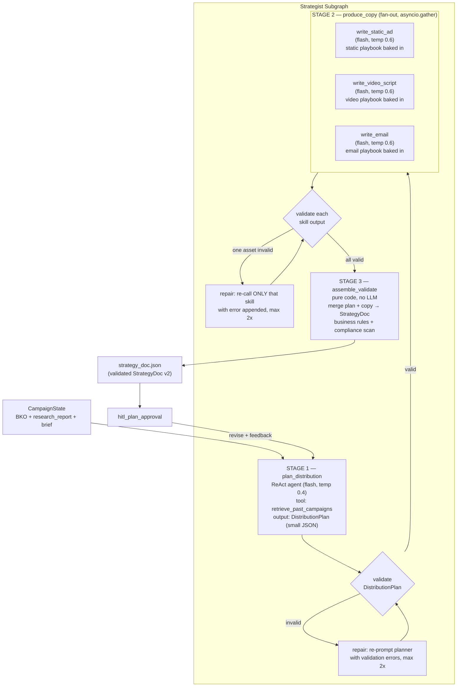

# Strategist Agent — v2 Architecture

> **Status:** Design proposal (supersedes the architecture in [STRATEGIST_AGENT.md](STRATEGIST_AGENT.md))
> **Model constraint:** `gemini-2.5-flash` only — for the planner, all skills, everything.
> **Goal:** A strategist that genuinely understands all three asset domains (static image, video, email) and emits a StrategyDoc the Producer can execute mechanically — with the contract *enforced*, not hoped for.

---

## 1. Design Principles (why v2 looks like this)

Flash is fast and cheap but it is not a strong long-horizon reasoner. Every v2 decision follows from that:

| Principle | Consequence |
|---|---|
| **Small, single-purpose LLM calls beat one big ReAct loop** | The monolithic "plan + call tools + transcribe + assemble 8k-token JSON" agent is split into a pipeline: one small planning call, N small copy calls, deterministic assembly in code. |
| **Domain knowledge is static — bake it into prompts, don't hope the model derives it** | Each asset type gets a dedicated specialist skill with an embedded craft playbook. The playbooks are the product; flash just executes them. |
| **Never let the LLM transcribe its own tool outputs** | v1's biggest silent failure: the agent paraphrases/compresses `write_asset_copy` output while assembling the final JSON. In v2, **code** assembles the StrategyDoc from structured skill outputs. Copy is never re-emitted by the model. |
| **Validate everything, repair narrowly** | Every skill output and the final doc are Pydantic-validated. A failure re-runs only the failing call with the error message appended — never the whole pipeline. |
| **LLMs rank better than they score** | The "score hook, revise if < 7" loop is replaced by best-of-3 candidate generation with self-selection inside each skill. |

### What this eliminates from v1

- ❌ 12,000-token monolithic final output (truncation risk, format drift)
- ❌ Copy transcription loss between skill output and final JSON
- ❌ Unformatted `{num_variants}` placeholder / double-brace JSON template in the system prompt
- ❌ `json.loads`-or-`{"raw_output": ...}` silent failure in the orchestrator node
- ❌ Type-blind copywriter persona and type-blind hook scoring
- ❌ Research `asset_type_insights` dead-ending in the agent's context instead of reaching the copywriter

---

## 2. Architecture Overview

The strategist becomes a **three-stage subgraph** (in `agents/strategist/graph.py`), exposed to the orchestrator as the single `run_strategist` node it already has.



**Division of labour:**

| Stage | Who | Decides |
|---|---|---|
| 1. Plan | LLM (ReAct agent) | *Strategy*: theme, narrative, how many of what type where, which angle/product/emotion per asset, per-asset hook direction |
| 2. Produce | LLM (3 specialist skills, plain async functions — **not** agent tools) | *Craft*: the actual copy, scripts, subject lines, visual briefs — per-domain playbooks |
| 3. Assemble | Code | *Nothing creative*: merge, validate, enforce rules, scan compliance |

Stage 2 skills are **no longer `@tool`s handed to a ReAct loop**. The planner outputs briefs; code fans out to the skills (in parallel — v1 was forced sequential by the ReAct loop). This is both faster and removes flash's weakest job (orchestrating many tool calls over a long context).

---

## 3. Stage 1 — The Distribution Planner

The only remaining ReAct agent. Its output is deliberately **small** (~1–2k tokens) so flash can produce it reliably.

### Configuration

```python
planner_agent = AgentBuilder(
    agent_name="strategist_planner",
    system_prompt=build_planner_prompt(num_variants=...),   # formatted per run — v1 bug fixed
    tool_names=["retrieve_past_campaigns"],
    skills=[],                                              # copy skills are NOT tools anymore
    llm_config=LLMConfig(
        provider="kie",
        model_name="gemini-2.5-flash",
        temperature=0.4,      # planning = structured decisions
        max_tokens=4000,      # DistributionPlan is small
    ),
)
```

### What the planner knows (system prompt content)

The full prompt draft is in §7.1. Its strategic core — the knowledge v1 was missing:

**Asset-type roles in a campaign system:**

| Asset type | Campaign role | Best at |
|---|---|---|
| `video_ad` | **Attention** — cold reach, stopping the scroll, introducing the story | TOFU awareness, emotional narrative, product-in-action |
| `static_image` | **Frequency** — retargeting, reinforcing one message per glance | MOFU/BOFU reminders, offers, single-benefit hammering |
| `email` | **Conversion** — owned audience, the closer | MOFU nurture, BOFU offers/urgency, the only place for long copy |

**Distribution logic by objective** (guidance, not hard rules — the planner may deviate with a stated reason):

| Objective | Weighting bias |
|---|---|
| `awareness` | video-heavy; statics introduce, don't push; email soft (brand story) |
| `traffic` / `engagement` | video + static balanced; curiosity hooks; email drives clicks not sales |
| `conversion` | static + email heavy (retarget + close); video only as proof/demo |
| `lead_gen` | email is the asset, video/static feed it |

**Sequence thinking:** assets are one narrative encountered in order (video → static → email), not independent artifacts. The planner writes a `narrative_arc` and assigns each asset a `role_in_campaign` (`attention | consideration | conversion`) plus a `key_message` — so the email can *assume* the video's story landed, and the static reinforces rather than re-introduces.

**Per-asset funnel stage:** for `funnel_stage: "balanced"` campaigns, the planner explicitly distributes tofu/mofu/bofu per asset and records it.

**Hard constraints (validated in code afterwards):**
- exactly `num_variants` asset briefs
- every requested platform covered ≥ 1; every requested asset type covered ≥ 1 (when `num_variants` allows)
- hero products distributed — no product on every asset
- `format` legal for the platform (checked against research `ad_specs`)
- email assets always `platform: "email"` regardless of the campaign `platforms` list

### Output — `DistributionPlan` (what the planner emits)

```python
class AssetBrief(BaseModel):
    """A strategy-level brief for ONE asset. No copy — that's Stage 2's job."""
    asset_id:         str                                  # "asset-1", "asset-2", ...
    asset_type:       Literal["static_image", "video_ad", "email"]
    platform:         Literal["instagram", "facebook", "tiktok", "youtube", "email"]
    format:           Literal["9:16", "4:5", "1:1", "16:9", "email"]
    funnel_stage:     Literal["tofu", "mofu", "bofu"]      # resolved per asset, even for "balanced"
    role_in_campaign: Literal["attention", "consideration", "conversion"]
    angle:            str        # from research recommended_angles (name)
    hero_product:     str        # exact product name from BKO
    target_emotion:   str
    hook_direction:   str        # 1-2 sentence creative direction for the hook
    key_message:      str        # THE one thing this asset must communicate
    tone:             str        # resolved: tone_override or brand tone or research rec

class DistributionPlan(BaseModel):
    campaign_theme:  str
    target_emotion:  str                    # campaign-level primary emotion
    narrative_arc:   str                    # how the assets connect as a sequence
    asset_briefs:    list[AssetBrief]       # exactly num_variants
    key_messages:    list[str]              # 3-5, campaign-wide
    what_to_avoid:   list[str]              # BKO compliance + brand don'ts + research
```

Parsed with fence-stripping + `DistributionPlan.model_validate()`. On failure: one repair turn with the Pydantic errors quoted back; max 2 retries; then hard-fail the node (never persist garbage).

---

## 4. Stage 2 — Three Specialist Copy Skills

One skill per domain. Each is a **plain async function** making a single flash call with:
1. a dedicated persona,
2. an embedded **craft playbook** (the domain expertise — see below),
3. the *relevant slice* of BKO + research piped in (v1 dead-end fixed),
4. a **structured JSON output contract** matching the Stage-3 schema exactly,
5. internal **best-of-3 hook generation** (see §8).

Common config: `gemini-2.5-flash`, `temperature=0.6`, `max_tokens=2500`. Each call is independent → all assets generate **in parallel** via `asyncio.gather`.

### 4.1 `write_static_ad`

**Persona:** performance creative director for paid social (Meta/TikTok static ads).

**Playbook (baked into the skill's system prompt):**
- **One message per asset.** If the brief's `key_message` needs a second idea, the second idea dies.
- The image must communicate value **with zero text read**. Headline reframes or adds to the image — never captions what the image already shows.
- Headline ≤ 8 words, concrete noun + benefit or curiosity gap. No puns on conversion campaigns.
- **Text overlay is composited after image generation** — so `image_prompt` describes the scene with **no text, no logos, no UI**. Overlay spec is separate: max one short phrase + optional sub-line, with placement + contrast direction, placed in negative space.
- Single focal point; specify camera angle, lighting, palette (pulled from BKO `visual_identity`), and mood in the `image_prompt`. Name a photographic style, not "nice photography".
- `body_copy` is the platform caption: first line is a second hook (Instagram truncates at ~125 chars), then 1-2 short lines, then CTA.
- CTA matches funnel stage: tofu = low-commitment ("See the story"), bofu = direct ("Order for Eid Delivery").

**Inputs (piped by code, not by an LLM):**
`AssetBrief` + audience pain points/triggers/objections + brand voice + **visual_identity** + `research.asset_type_insights.static_image` + platform `ad_specs` for this format + `restricted_claims`/forbidden topics + campaign `narrative_arc` + `special_brief`.

**Output (structured JSON):**

```json
{
  "hook": "the scroll-stopping idea in one line",
  "hook_alternatives": ["candidate 2", "candidate 3"],
  "headline": "...",
  "body_copy": "caption text",
  "cta": "...",
  "image_prompt": "pure visual scene — subject, environment, lighting, camera, palette, style. NO text.",
  "text_overlay": {"text": "...", "placement": "bottom-left", "style_note": "handwritten white, high contrast"},
  "visual_avoid": ["stock-photo feel", "cluttered composition", "..."]
}
```

### 4.2 `write_video_script`

**Persona:** short-form video director + scriptwriter (TikTok / Reels / Shorts).

**Playbook:**
- **Hook = 0–2s, assume muted.** ~85% watch without sound: `on_screen_text` must carry the hook's meaning on its own. Open with motion or a pattern-interrupt — never a logo, never a slow establishing shot.
- **Script structure by funnel stage:** tofu = problem-agitate or curiosity; mofu = demo / story / testimonial; bofu = offer + deadline.
- Script is a list of **beats**, each `{timing, visual, voiceover, on_screen_text}` — visuals, VO, and overlay text are separate fields because the Producer sends them to different systems (video gen, TTS, overlay renderer). Beats run 2–4s on TikTok, slightly longer on Reels.
- **Captions are mandatory** — every voiceover line has matching on-screen text or captions.
- **Safe zones:** keep text in the centre ~80% of frame; bottom ~15% and right edge are platform UI chrome in 9:16.
- **Platform grammar:** TikTok wants native, handheld, UGC-feel; Reels tolerates polish; YouTube Shorts sits between. Say which in the visual style.
- Duration: 15–30s for conversion, up to 45–60s only for awareness storytelling; must respect the platform `max_duration` from research `ad_specs`.
- End card: product + CTA overlay for the final 2–3s. Loopable ending is a bonus on TikTok.
- Sound: name a direction (trending-audio style, VO voice + accent per audience geography, or ASMR/ambient). Never "add music".

**Inputs:** `AssetBrief` + audience intel + brand voice + visual_identity + `asset_type_insights.video_ad` (hook_timing, script_structure, sound_trends) + platform `ad_specs` + compliance + `narrative_arc` + `special_brief`.

**Output:**

```json
{
  "hook": "first-frame concept in one line",
  "hook_alternatives": ["...", "..."],
  "headline": "caption headline",
  "caption": "platform caption incl. first-line hook",
  "cta": "...",
  "duration_seconds": 22,
  "script": [
    {"timing": "0-2s",  "visual": "extreme close-up ...", "voiceover": null, "on_screen_text": "Found at 3,000m"},
    {"timing": "2-8s",  "visual": "quick cuts: ...",      "voiceover": "In Hunza, ...", "on_screen_text": "hand-picked once a year"},
    {"timing": "8-12s", "visual": "...", "voiceover": "...", "on_screen_text": "..."}
  ],
  "sound_direction": "soft oud instrumental under warm female VO, Urdu accent welcome",
  "visual_style": "native handheld UGC feel, warm golden grade, macro product shots",
  "visual_avoid": ["stock footage", "slow intro", "logo-first opening"]
}
```

### 4.3 `write_email`

**Persona:** direct-response email copywriter (owned-list marketing).

**Playbook:**
- Email is **not an interruption** — it was opened intentionally. The battle is the inbox: subject + preview decide everything.
- **Subject ≤ 45 chars** (mobile truncation), concrete benefit or specific curiosity. No spam triggers: no ALL CAPS, no "FREE!!!", no excessive punctuation, no deceptive "Re:/Fwd:".
- **Preview text complements the subject — never repeats it.** ≤ 90 chars; treat it as the subject's second line.
- **Inverted pyramid:** the value proposition lands in sentence one. Paragraphs of 1–2 lines. Scannable. Story-driven for mofu; offer + deadline for bofu.
- **ONE CTA**, same text, appearing exactly twice (after the opening section and at the end). Competing CTAs kill click-through.
- Assume the reader knows the brand (owned list) — reference the campaign narrative ("the jars you saw…") per `narrative_arc`.
- `cta_url` comes from BKO `offerings.conversion_url` — resolved here so the Producer never digs in the BKO.
- Mobile-first single column; hero image brief is separate from copy; required disclosures placed above the footer.

**Inputs:** `AssetBrief` + audience intel + brand voice + `asset_type_insights.email_template` (subject_line_patterns, layout best practices) + messaging value props + compliance incl. `required_ad_disclosures` + `conversion_url` + `narrative_arc` + `special_brief`.

**Output:**

```json
{
  "hook": "the subject-line idea in one line",
  "hook_alternatives": ["...", "..."],
  "subject_line": "≤45 chars",
  "preview_text": "≤90 chars, complements subject",
  "headline": "inside the email",
  "body_paragraphs": ["para 1 — value first", "para 2", "para 3"],
  "cta_text": "Order Your Jar",
  "cta_url": "https://karakoramkitchen.pk/shop",
  "hero_image_brief": "specific hero image description",
  "layout_notes": "single column, hero top, CTA after para 1 and at end",
  "disclosures": ["required disclosure text if any"]
}
```

### Skill-output parsing & repair

Each skill response: strip fences → `json.loads` → validate against the matching Pydantic copy model. On failure, **re-call only that skill once** with the error appended ("Your last output failed validation: `subject_line` 62 chars > 50 max. Re-emit the full JSON, fixed."). Second failure → hard-fail the node with a clear error event. No silent fallbacks.

---

## 5. Stage 3 — Assembly, Validation, Compliance (pure code)

`assemble_validate` merges each `AssetBrief` + its skill output into a typed per-asset plan, builds the `StrategyDoc`, and enforces the contract. **No LLM call** — copy passes through verbatim.

### Validation rules (all in `validation.py`, all deterministic)

| Rule | Source of truth |
|---|---|
| `len(asset_plan) == num_variants` | brief |
| Every requested platform has ≥ 1 asset; every requested asset type has ≥ 1 (if `num_variants` allows) | brief |
| `format` valid for `platform` (email→email, tiktok→9:16, instagram→9:16/4:5/1:1, …) | static table + research `ad_specs` |
| `hero_product` exists in BKO offerings; no single product on **all** assets | BKO |
| Video: `script` non-empty, every beat has `visual` + `on_screen_text`, `duration_seconds ≤` platform max | schema + research |
| Email: subject ≤ 50, preview ≤ 90, `cta_url` non-empty | schema |
| Static: `image_prompt` contains no text-rendering instructions (regex for `text:|overlay|font` inside image_prompt) | schema |
| No placeholder tokens (`TBD`, `lorem`, `[insert`, `write here`) anywhere | scan |
| **Compliance scan:** case-insensitive substring match of `restricted_claims` phrases + `forbidden_topics` terms against every copy field | BKO |

Rule violations that trace to one asset → targeted repair (re-call that skill with the violation). Violations that trace to the plan (coverage, distribution) → one planner repair turn. Everything green → persist.

This stage is also where the **v1 orchestrator bug dies**: [`run_strategist`](../../orchestrator/nodes.py) never does bare `json.loads` again — it invokes the subgraph and receives either a validated `StrategyDoc` or a typed failure.

---

## 6. Schemas v2 (`agents/strategist/schemas.py`)

Discriminated union — per-type required fields are enforced by Pydantic, not by prompt.

```python
from typing import Annotated, Literal, Union
from pydantic import BaseModel, Field

# ── shared strategy header (from the planner) ────────────────────────────────
class AssetStrategy(BaseModel):
    asset_id:         str
    platform:         Literal["instagram", "facebook", "tiktok", "youtube", "email"]
    format:           Literal["9:16", "4:5", "1:1", "16:9", "email"]
    funnel_stage:     Literal["tofu", "mofu", "bofu"]
    role_in_campaign: Literal["attention", "consideration", "conversion"]
    angle:            str
    hero_product:     str
    target_emotion:   str
    key_message:      str
    hook:             str                        # first-class, every asset type
    copy_tone:        str
    compliance_notes: str = ""

# ── per-type plans ────────────────────────────────────────────────────────────
class TextOverlay(BaseModel):
    text: str
    placement: str
    style_note: str = ""

class StaticImagePlan(AssetStrategy):
    asset_type: Literal["static_image"] = "static_image"
    headline: str
    body_copy: str                               # platform caption
    cta: str
    image_prompt: str                            # pure scene — no text/logos
    text_overlay: TextOverlay
    visual_avoid: list[str] = []

class ScriptBeat(BaseModel):
    timing: str                                  # "0-2s"
    visual: str
    voiceover: str | None = None
    on_screen_text: str                          # muted-viewing rule: never empty on the hook beat

class VideoAdPlan(AssetStrategy):
    asset_type: Literal["video_ad"] = "video_ad"
    headline: str
    caption: str
    cta: str
    duration_seconds: int
    script: list[ScriptBeat]                     # min 3 beats: hook, story, cta
    sound_direction: str
    visual_style: str
    visual_avoid: list[str] = []

class EmailPlan(AssetStrategy):
    asset_type: Literal["email"] = "email"
    subject_line: str = Field(max_length=50)
    preview_text: str = Field(max_length=90)
    headline: str
    body_paragraphs: list[str]
    cta_text: str
    cta_url: str
    hero_image_brief: str
    layout_notes: str = ""
    disclosures: list[str] = []

AssetPlan = Annotated[
    Union[StaticImagePlan, VideoAdPlan, EmailPlan],
    Field(discriminator="asset_type"),
]

# ── the contract with the Producer ────────────────────────────────────────────
class StrategyDoc(BaseModel):
    campaign_theme: str
    target_emotion: str
    narrative_arc:  str                          # how assets connect as a sequence
    asset_plan:     list[AssetPlan]
    key_messages:   list[str]
    what_to_avoid:  list[str]
```

> **Producer mapping:** `asset_type` is the sub-agent router (`static_image` → Imagen sub-agent, `video_ad` → Veo sub-agent, `email` → HTML renderer). Update [CAMPAIGN_PIPELINE.md](../CAMPAIGN_PIPELINE.md) §8–9 to this schema — the old `sub_agent`/`copy_notes` shape is superseded.

---

## 7. Prompts

### 7.1 Planner system prompt (draft)

Built per run by `build_planner_prompt(num_variants)` — **actually formatted**, fixing the v1 placeholder bug.

```
You are the Campaign Architect in an ad generation pipeline. You do NOT write
copy. You design the campaign structure: which assets to make, what job each
one does, and the creative direction each one follows. Specialist copywriters
will execute your briefs exactly — so every brief must be decisive and specific.

## How the three asset types work together
- video_ad → ATTENTION. Cold reach. Stops the scroll, introduces the story.
  Best for tofu and emotional narrative.
- static_image → FREQUENCY. Retargeting and reinforcement. One message per
  glance. Best for mofu/bofu reminders and offers.
- email → CONVERSION. The owned-audience closer. The only long-copy format.
  Best for mofu nurture and bofu offers.

A person may see the video first, the static second, the email last. Design
them as ONE story told in sequence, not as independent ads. Write a
narrative_arc and give every asset a role_in_campaign and a key_message that
builds on the previous step.

## Distribution logic
Weight the mix by objective:
- awareness → video-heavy
- traffic/engagement → video + static, curiosity hooks
- conversion → static + email heavy, video only as proof/demo
- lead_gen → email is the star, video/static feed it
Respect the constraints: exactly {num_variants} assets; every requested
platform gets at least one asset; every requested asset type appears at least
once if the count allows; spread hero products — no product appears on every
asset; for funnel_stage "balanced", assign tofu/mofu/bofu per asset yourself.
Choose each asset's format from the platform specs in the research report.
Email assets always use platform "email".

## Process
1. Read the research report: competitor gaps, recommended angles, platform
   specs, audience triggers and objections.
2. Call retrieve_past_campaigns once. If it returns no data, move on without
   further consideration.
3. Assign angles from the research's recommended_angles to the platforms and
   funnel stages they fit best. Write a hook_direction for each asset that a
   copywriter can execute without asking questions.
4. Emit the DistributionPlan JSON.

## Output
Return ONLY a JSON object matching this schema (no markdown fences):
{schema_example}
```

(`{schema_example}` is a compact one-asset example generated from the Pydantic model — single-brace, real JSON, since the prompt is now formatted by code.)

### 7.2 Skill prompts

Each skill's system prompt = persona (2 lines) + the full playbook from §4 + the output JSON contract + the line:

```
First, internally draft 3 candidate hooks [subject lines for email]. Judge them
against the playbook and this brief's key_message, pick the strongest as
"hook", and return the other two in "hook_alternatives". Then write all copy
executing the chosen hook. Return ONLY the JSON object.
```

The user prompt is assembled by code from the piping matrix (§9) — the skill never sees the whole BKO or the whole research report, only its slice.

---

## 8. Hook Quality — best-of-3 replaces score-until-7

v1's loop ("evaluate_hook_strength, revise if < 7") had three flaws: flash judging flash gives noisy absolute scores; the loop was prompt-enforced and unverifiable; the rubric was type-blind (an email "hook" is a subject line judged on open-rate psychology, not scroll-stopping).

v2: each specialist skill generates **3 candidates internally and self-selects** against its own playbook criteria — ranking, which LLMs do far more reliably than absolute scoring — in the *same* call (no extra latency/cost). The rejected candidates ship as `hook_alternatives`, which the HITL review UI can surface as one-click swaps for the human reviewer. `evaluate_hook_strength` is deleted.

---

## 9. Data Piping Matrix (what each call receives)

| Input slice | Planner | write_static_ad | write_video_script | write_email |
|---|:-:|:-:|:-:|:-:|
| Campaign brief (objective, platforms, num_variants, funnel, special_brief) | ✅ full | brief excerpt | brief excerpt | brief excerpt |
| BKO identity + products + USPs | ✅ | featured product only | featured product only | featured product only |
| BKO brand voice | ✅ summary | ✅ | ✅ | ✅ |
| BKO **visual_identity** (colors, aesthetic, imagery style) | — | ✅ | ✅ | hero image brief only |
| BKO audience (pain points, triggers, objections) | ✅ | ✅ | ✅ | ✅ |
| BKO compliance (restricted_claims, forbidden_topics, disclosures) | ✅ | ✅ | ✅ | ✅ + disclosures |
| BKO `offerings.conversion_url` | — | — | — | ✅ |
| Research: recommended_angles | ✅ | via AssetBrief.angle | via AssetBrief.angle | via AssetBrief.angle |
| Research: platform_insights.ad_specs | ✅ (format choice) | this format's spec | this format's spec (max_duration!) | — |
| Research: asset_type_insights.**static_image** | — | ✅ | — | — |
| Research: asset_type_insights.**video_ad** | — | — | ✅ | — |
| Research: asset_type_insights.**email_template** | — | — | — | ✅ |
| Research: competitor patterns + audience intel | ✅ | key items via brief | key items via brief | key items via brief |
| Planner's `narrative_arc` + this asset's `AssetBrief` | n/a | ✅ | ✅ | ✅ |

This fixes v1's dead-end: the researcher's per-type insights finally reach the writer that needs them — and nothing else bloats the context of a flash call.

---

## 10. HITL Revision Path

`hitl_plan_approval` currently falls through to the Producer unconditionally. v2 wires rejection:

```
hitl_response = {approved: false, feedback: "asset-2's hook is weak, and don't
                 use scarcity on the email"}
        │
        ▼
plan_revision (planner, one call):
  input  = previous DistributionPlan + human feedback
  output = RevisionPlan {
      keep:       ["asset-1", "asset-3", "asset-4"],
      regenerate: [{asset_id: "asset-2", revised_brief: AssetBrief}],
      plan_edits: {what_to_avoid: [..., "scarcity framing in email"]}
  }
        │
        ▼
produce_copy runs ONLY for `regenerate` entries (approved copy is never touched)
        │
        ▼
assemble_validate → back to hitl_plan_approval
```

Targeted regeneration preserves human-approved work and keeps revision cost at one planner call + K skill calls instead of a full re-run.

---

## 11. Events (SSE)

| Event | Payload |
|---|---|
| `agent_started` | `{message: "Strategist planning campaign structure"}` |
| `tool_call` / `tool_result` | planner's `retrieve_past_campaigns` |
| `plan_ready` | `{asset_count, distribution: {video_ad: 1, static_image: 2, email: 1}, theme}` |
| `asset_copy_started` | `{asset_id, asset_type, platform}` — one per fan-out branch |
| `asset_copy_done` | `{asset_id, hook, headline}` — preview for the UI |
| `validation_repair` | `{target: "asset-3", errors: [...]}` — visible, not silent |
| `agent_completed` | `{message: "Strategy document ready", asset_count}` |
| `hitl_required` | full validated `StrategyDoc` |

Per-asset events give the frontend real progress (v1 could only show opaque tool calls).

---

## 12. File Layout & Migration

```
agents/strategist/
  agent.py         planner AgentBuilder (was: monolithic strategist_agent)
  graph.py         strategist subgraph: plan → produce_copy → assemble_validate
  prompts.py       build_planner_prompt(), build_planner_input(), brief→skill prompt builders
  playbooks.py     STATIC_PLAYBOOK, VIDEO_PLAYBOOK, EMAIL_PLAYBOOK (prompt constants)
  skills.py        write_static_ad, write_video_script, write_email (plain async funcs)
  schemas.py       v2 schemas (§6): DistributionPlan, AssetBrief, StrategyDoc union
  validation.py    fence-strip/parse helpers, rule table, compliance scan, repair loop
```

### Migration checklist

1. [ ] `schemas.py` → v2 (discriminated union, `DistributionPlan`) — **do first**, everything types against it
2. [ ] `playbooks.py` + rewrite `skills.py` as three structured-output specialists; delete `evaluate_hook_strength` and `write_asset_copy`
3. [ ] `prompts.py` → planner prompt (formatted per run — kills the `{num_variants}` bug) + per-skill prompt builders implementing the §9 piping matrix
4. [ ] `validation.py` + `graph.py` (subgraph with fan-out + repair loops)
5. [ ] `orchestrator/nodes.py::run_strategist` → invoke subgraph; remove bare `json.loads` fallback; emit new events
6. [ ] Wire `hitl_plan_approval` rejection → `plan_revision`
7. [ ] Update `CAMPAIGN_PIPELINE.md` §8–9 Producer contract to schema v2; regenerate the stale `generations/*/strategy_doc.json` fixtures
8. [ ] Standalone runner (`python -m agents.strategist.agent`) re-pointed at the subgraph with the Karakoram fixture

### Token budget (flash, per run, num_variants = 4)

| Call | Output budget | Count |
|---|---|---|
| Planner | ≤ 4,000 | 1 (+ ≤ 2 repairs) |
| Specialist skill | ≤ 2,500 | 4 in parallel (+ targeted repairs) |
| Assembly | 0 (code) | — |

Worst-case output ≈ 14k tokens *spread across 5 small calls* instead of v1's single 12k monolith — no call is ever near its own truncation limit, and the wall-clock is lower because copy generation is parallel.

---

## 13. Why this works on gemini-2.5-flash

1. **No call asks flash to do more than one job.** Plan (structured decision), write one asset (craft with a playbook), or nothing (code). Flash's failure mode — degrading over long multi-step tool loops — is designed out.
2. **The expertise lives in the prompts, not the model.** The three playbooks encode what a stronger model might partially infer; flash just has to follow them, which it does well.
3. **Copy is written once and never re-emitted.** The single biggest quality leak in v1 (transcription through the ReAct loop) is structurally impossible in v2.
4. **Every output is validated and narrowly repaired.** Flash's format slips (fences, truncation, missing fields) become one cheap retry of one small call — never a corrupted `strategy_doc.json`.
5. **When you later want a quality ceiling raise**, you swap the model in exactly one place — the three specialist skills — without touching architecture.
